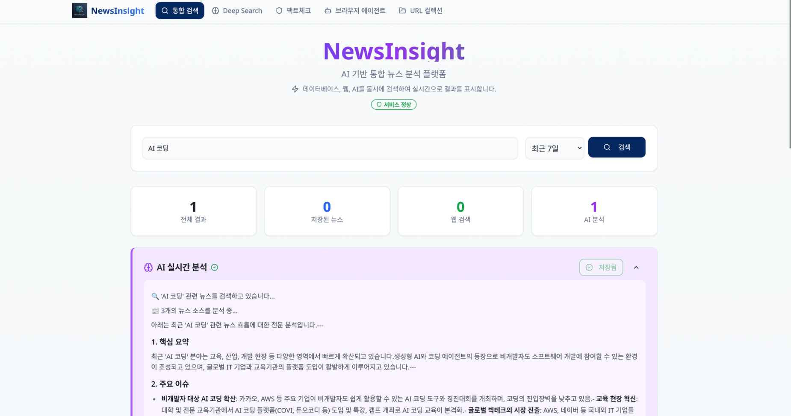

# NewsInsight

마이크로서비스 아키텍처 기반으로 뉴스 데이터를 수집하고, 분석하여 인사이트를 제공하는 플랫폼입니다.

## 미리보기

<p align="center">
  
</p>

## 프로젝트 구조

```bash
NewsInsight/
├── backend/                          # 백엔드 마이크로서비스
│   ├── api-gateway-service/         # Spring Cloud Gateway 기반 API 라우팅 게이트웨이
│   ├── data-collection-service/     # 뉴스 데이터 수집 및 RSS 피드 처리 서비스
│   └── shared-libs/                 # 공통 유틸리티 및 도메인 모듈
│
├── frontend/                        # React 기반 웹 프론트엔드
│
├── docs/                           # 문서
│   └── backend/                    # 백엔드 서비스별 문서
│       ├── data-collection-service/
│       └── init_document/
│
├── etc/                            # 설정 및 인프라 관련 파일
│   ├── configs/                    # 환경 설정 파일(.env)
│   │   ├── development.env
│   │   ├── staging.env
│   │   └── production.env
│   ├── docker/                     # Docker Compose 파일
│   │   └── docker-compose.consul.yml
│   ├── scripts/                    # 유틸리티 스크립트
│   └── infra-guides/              # 인프라 마이그레이션 가이드
│
├── archived-python-backends/       # 과거 Python 백엔드 서비스(아카이브)
│
├── build.gradle.kts               # 루트 Gradle 빌드 설정
├── settings.gradle.kts            # Gradle 멀티 모듈 설정
└── gradle.properties              # Gradle 공통 속성
```

## 기술 스택

### 백엔드 서비스

- **프레임워크**: Spring Boot 3.2.1 (Java 21)
- **서비스 디스커버리**: Consul
- **API 게이트웨이**: Spring Cloud Gateway
- **데이터베이스**: PostgreSQL
- **캐시**: Redis
- **빌드 도구**: Gradle 8.5+

### 프론트엔드

- **프레임워크**: React + TypeScript
- **번들러/빌드**: Vite
- **UI 컴포넌트**: shadcn/ui

## 시작하기 (Getting Started)

### 사전 준비 사항

- Java 21 이상
- Node.js 18+ 및 npm/bun
- Docker 및 Docker Compose
- Consul (서비스 디스커버리)
- PostgreSQL (데이터 저장)
- Redis (캐싱 및 Rate Limiting)

### 빌드 방법

#### 백엔드 서비스

```bash
# 전체 서비스 빌드
./gradlew clean build

# 개별 서비스 빌드
./gradlew :backend:api-gateway-service:build
./gradlew :backend:data-collection-service:build

# 테스트 실행
./gradlew test
```

#### 프론트엔드

```bash
cd frontend
npm install
npm run dev
```

## Docker Compose로 전체 스택 실행

가장 간단하게 전체 스택을 실행하는 방법입니다:

```bash
cd etc/docker
docker-compose -f docker-compose.consul.yml up
```

위 명령을 실행하면 다음 구성 요소가 함께 기동됩니다.

- Consul (서비스 디스커버리 및 설정)
- PostgreSQL 데이터베이스
- Redis 캐시
- API Gateway (기본 포트: 8000)
- Data Collection Service (기본 포트: 8081)

## 개별 서비스 실행

#### API Gateway 실행

```bash
./gradlew :backend:api-gateway-service:bootRun
```

#### Data Collection Service 실행

```bash
./gradlew :backend:data-collection-service:bootRun
```

실행 전 아래 환경 변수를 적절히 설정해야 합니다.

- `CONSUL_HOST`: Consul 서버 호스트 (기본값: localhost)
- `CONSUL_PORT`: Consul 서버 포트 (기본값: 8500)
- `DB_HOST`: PostgreSQL 호스트 (기본값: localhost)
- `DB_PORT`: PostgreSQL 포트 (기본값: 5432)
- `DB_NAME`: 데이터베이스 이름 (기본값: newsinsight)
- `DB_USER`: 데이터베이스 사용자 (기본값: postgres)
- `DB_PASSWORD`: 데이터베이스 비밀번호 (기본값: postgres)

## 서비스 아키텍처 개요

### API Gateway (`api-gateway-service`)

- 외부 요청을 각 백엔드 마이크로서비스로 라우팅
- JWT 기반 인증/인가 처리
- Redis를 이용한 Rate Limiting 적용
- Consul 기반 서비스 디스커버리
- 기본 포트: 8000

### Data Collection Service (`data-collection-service`)

- 뉴스 소스 및 RSS 피드 관리
- 뉴스 기사 수집 및 전처리
- 데이터 검증 및 품질 관리
- Consul 기반 서비스 디스커버리
- 기본 포트: 8081

### Shared Libraries (`shared-libs`)

- 공통 유틸리티 및 도메인 모델
- Consul 설정 헬퍼
- 유효성 검증 유틸리티
- JSON 처리 유틸리티

## 설정 (Configuration)

구성은 다음 우선순위로 관리됩니다.

1. **Application YAML**: 각 서비스의 `src/main/resources/application.yml`
2. **환경 변수(Environment Variables)**: 컨테이너/실행 환경에서 주입
3. **Consul KV Store**: 중앙 집중식 구성 관리 (`config/` prefix)
4. **환경 파일(.env)**: `etc/configs/` 디렉터리 내 파일

### Consul 설정 초기화

Consul KV에 기본 설정을 시드하려면:

```bash
cd etc/scripts
./consul_seed.sh development
```

## 개발 가이드

### 코드 스타일

- Java: Spring Boot 관례 및 프로젝트 내 기존 컨벤션 준수
- Frontend: ESLint 설정 포함 (프로젝트의 ESLint 규칙 사용)

### 새로운 서비스 추가 절차

1. `backend/` 하위에 신규 서비스 디렉터리 생성
2. `settings.gradle.kts` 에 모듈 추가
3. 신규 서비스용 `build.gradle.kts` 작성
4. Spring Boot 기반 서비스 구현
5. 필요 시 Dockerfile 추가
6. Docker Compose로 운영할 경우 `docker-compose.consul.yml` 에 서비스 정의 추가

### 테스트 실행

```bash
# 전체 테스트
./gradlew test

# 특정 서비스만 테스트
./gradlew :backend:api-gateway-service:test
```

## 문서 (Documentation)

각 서비스별 상세 문서는 `docs/` 디렉터리에 있습니다.

- [Data Collection Service](docs/backend/data-collection-service/crawler/en/overview.md)
- 서비스가 실행 중일 때, Swagger UI 등을 통해 API 문서에 접근할 수 있습니다.

## 마이그레이션 노트

본 프로젝트는 기존 Python 기반 마이크로서비스에서 Spring Boot 기반으로 마이그레이션되었습니다.

- 마이그레이션 상세: [SPRING_BOOT_MIGRATION_PLAN.md](etc/infra-guides/SPRING_BOOT_MIGRATION_PLAN.md)
- Consul 구성 마이그레이션: [CONSUL_MIGRATION.md](etc/infra-guides/CONSUL_MIGRATION.md)
- 기존 Python 백엔드는 `archived-python-backends/` 디렉터리에 보관되어 있습니다.

## 기여 (Contributing)

1. `main` 브랜치에서 기능 브랜치 생성
2. 변경 사항 구현
3. 테스트 및 빌드 통과 여부 확인
4. Pull Request 생성
