# NewsInsight Platform

<div align="center">

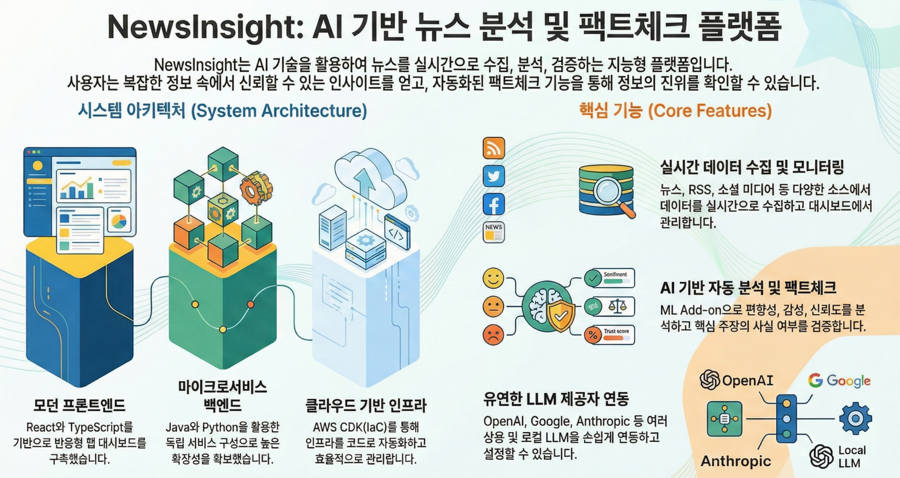

**AI 기반 뉴스 인텔리전스 플랫폼**

뉴스 수집 · 팩트체킹 · 심층 분석 · AI 리포팅을 하나의 통합 워크벤치로 제공합니다

[](https://aws.amazon.com/)
[](https://spring.io/projects/spring-boot)
[](https://reactjs.org/)
[](https://kafka.apache.org/)

[Features](#-주요-기능) · [Architecture](#-시스템-아키텍처) · [AWS Infrastructure](#️-aws-클라우드-인프라) · [Getting Started](#-시작하기) · [Documentation](#-문서)

</div>

---

## 📋 목차

- [개요](#-개요)
- [주요 기능](#-주요-기능)
- [시스템 아키텍처](#-시스템-아키텍처)
- [AWS 클라우드 인프라](#️-aws-클라우드-인프라)
- [서비스 구성](#-서비스-구성)
- [기술 스택](#-기술-스택)
- [시작하기](#-시작하기)
- [문서](#-문서)

---

## 🎯 개요

NewsInsight는 **AI 기반 뉴스 인텔리전스 플랫폼**으로, 뉴스 수집부터 팩트체킹, 심층 분석, AI 리포팅까지 전 과정을 자동화합니다.

### 핵심 가치

- 🔍 **자율 크롤링**: Brave/Perplexity/Tavily 등 다중 검색 엔진 통합
- ✅ **팩트체킹**: 학술 DB(Semantic Scholar, PubMed, CORE) 기반 검증
- 🤖 **AI 분석**: 다중 LLM 통합 (OpenAI, Anthropic, Gemini, Bedrock 등)
- 📊 **심층 리포팅**: 감성 분석, 키워드 추출, 편향 탐지
- ☁️ **클라우드 네이티브**: AWS 완전 관리형 서비스 활용

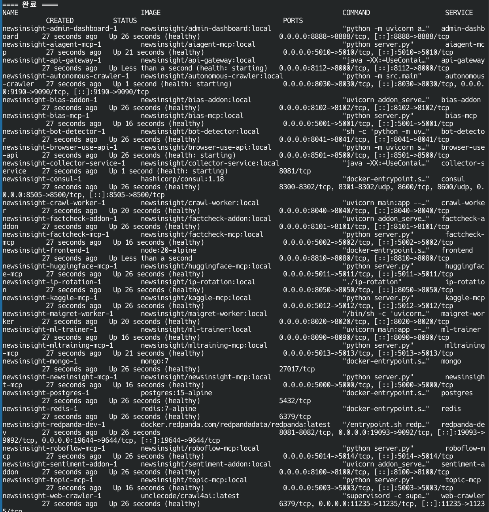

---

## 🚀 주요 기능

### 1. 통합 검색 시스템

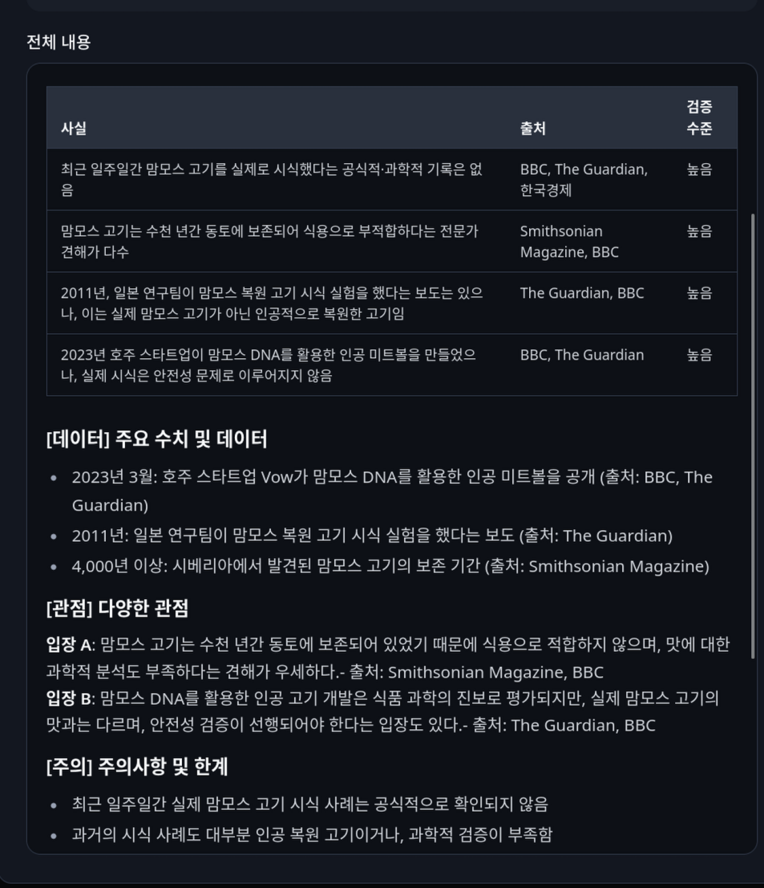

- **SmartSearch**: 키워드 + 시맨틱 하이브리드 검색
- **DeepSearch**: 다중 소스 병렬 검색 및 RRF 융합
- **ParallelSearch**: 실시간 SSE 스트리밍 검색

### 2. 팩트체크 챗봇

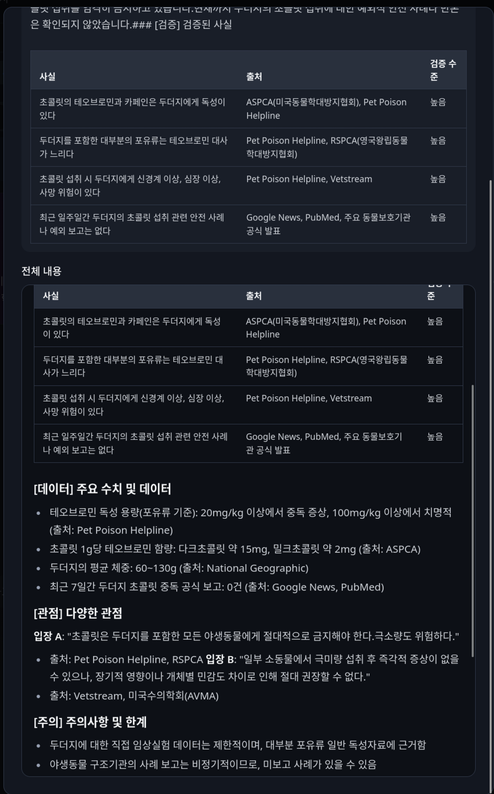

- **다중 학술 DB 검증**: Semantic Scholar, PubMed, CORE, CrossRef, OpenAlex
- **RRF 기반 증거 융합**: 여러 검색 쿼리 병렬 실행 후 랭킹 융합
- **실시간 스트리밍**: SSE 기반 실시간 검증 결과 제공
- **신뢰도 점수**: 출처별 신뢰도 가중치 적용

### 3. 실시간 크롤링

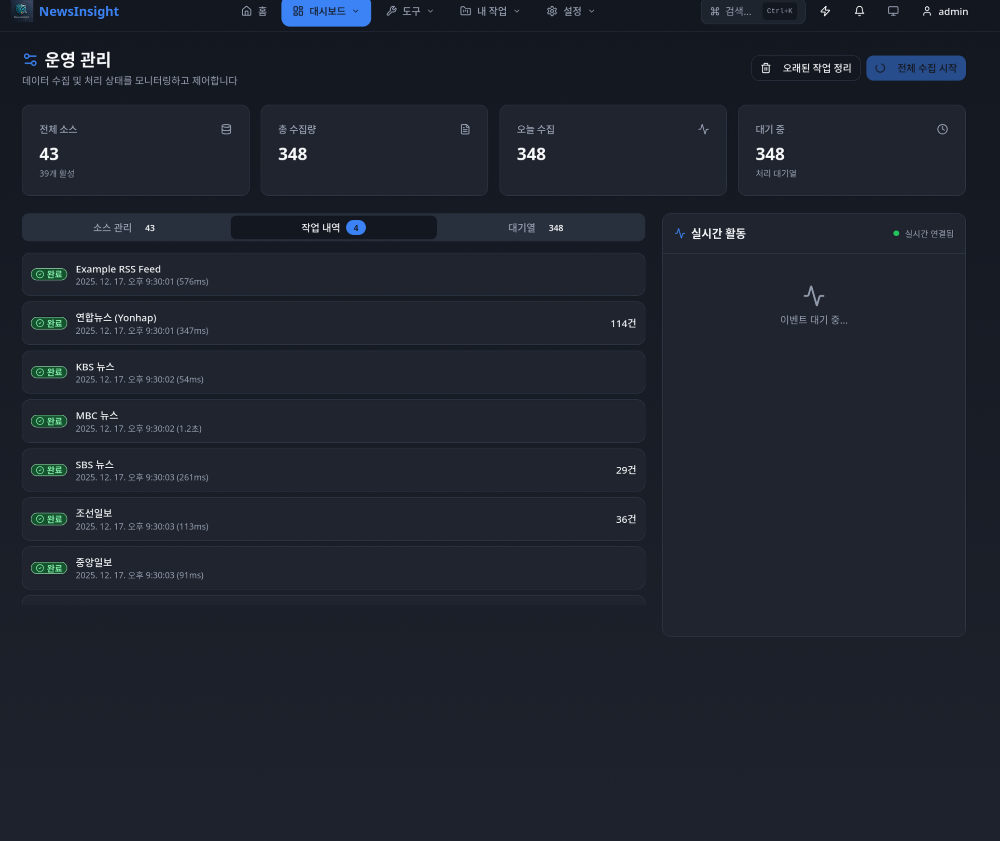

- **자율 크롤링**: Kafka 기반 비동기 크롤링 파이프라인
- **다중 검색 엔진**: Brave, Perplexity, Tavily 통합
- **캡챠 우회**: nopecha, camoufox 활용
- **중복 제거**: 콘텐츠 해시 기반 중복 필터링

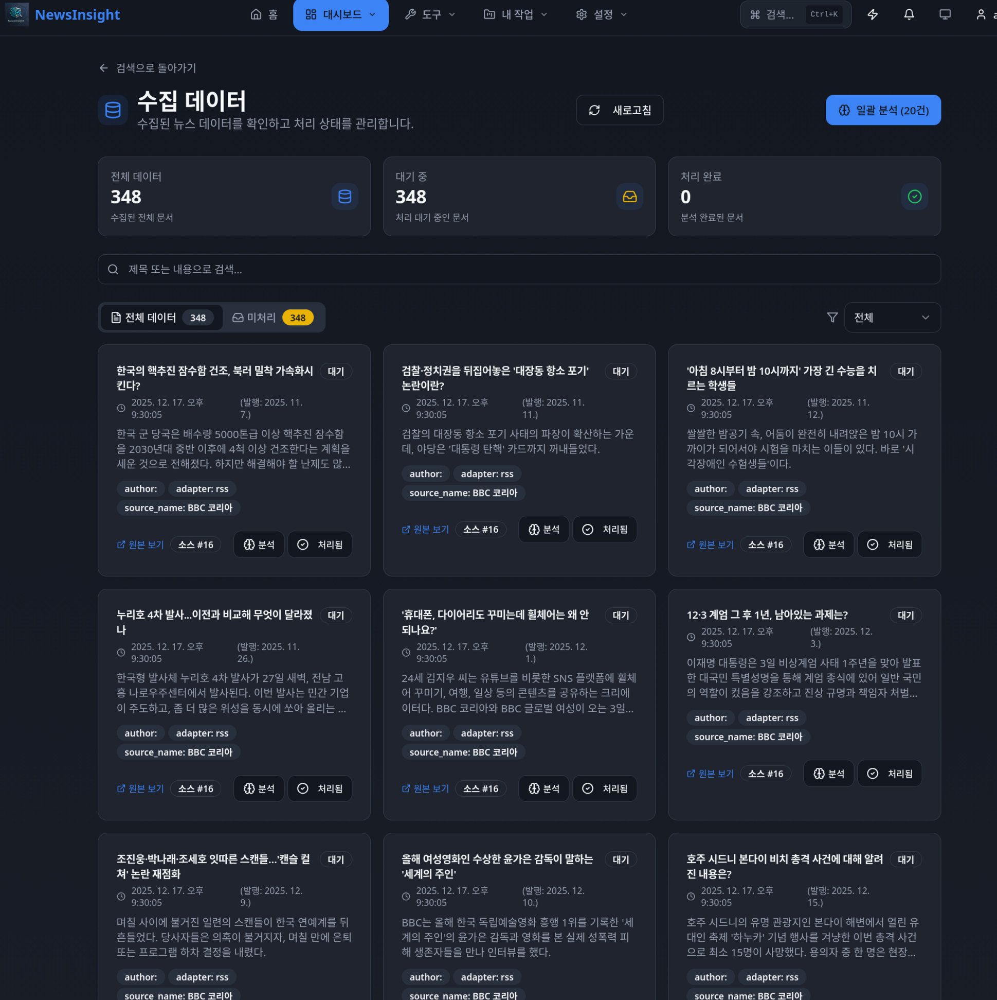

### 4. AI 심층 보고서

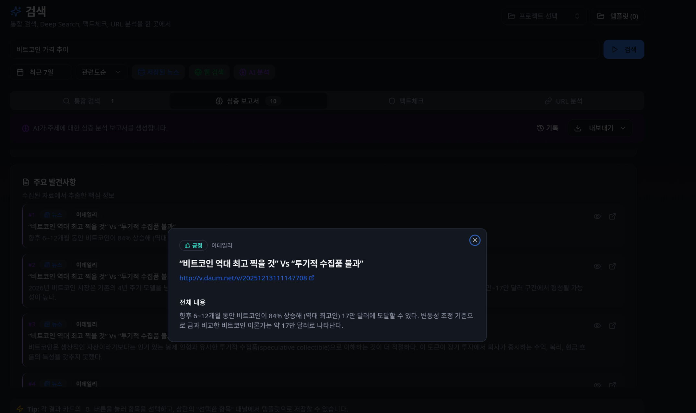

- **감성 분석**: 긍정/부정/중립 감성 분포
- **키워드 추출**: TF-IDF 기반 핵심 키워드
- **편향 탐지**: ML 기반 편향 분석
- **PDF 내보내기**: 차트 포함 전문 리포트

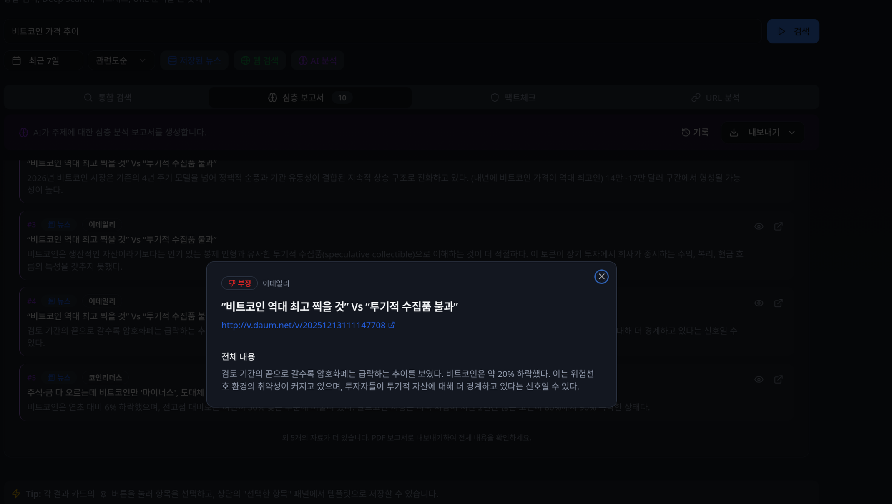

### 5. URL 컬렉션 관리

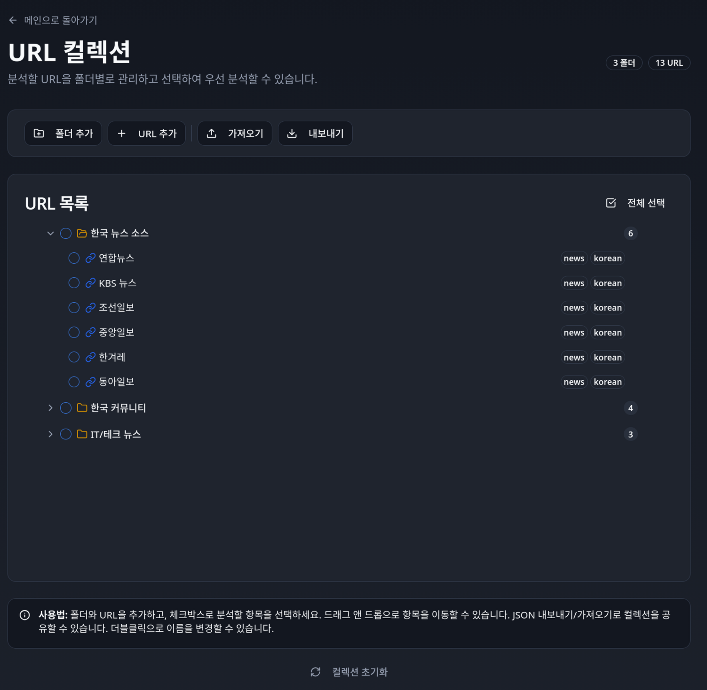

- **소스 관리**: RSS, Web, API 소스 통합 관리
- **스케줄링**: 수집 주기 설정 및 자동 실행
- **상태 추적**: 실시간 수집 작업 모니터링

### 6. 운영 관리 대시보드

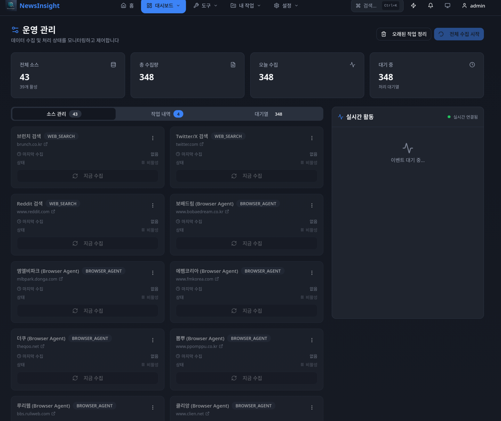

- **시스템 모니터링**: 서비스 헬스 체크
- **LLM 프로바이더 관리**: 다중 AI 모델 통합
- **ML 애드온 제어**: 플러그인 방식 ML 모델 관리

---

## 🏗 시스템 아키텍처

### 전체 구성도


### 사용자 인터페이스 및 API Gateway

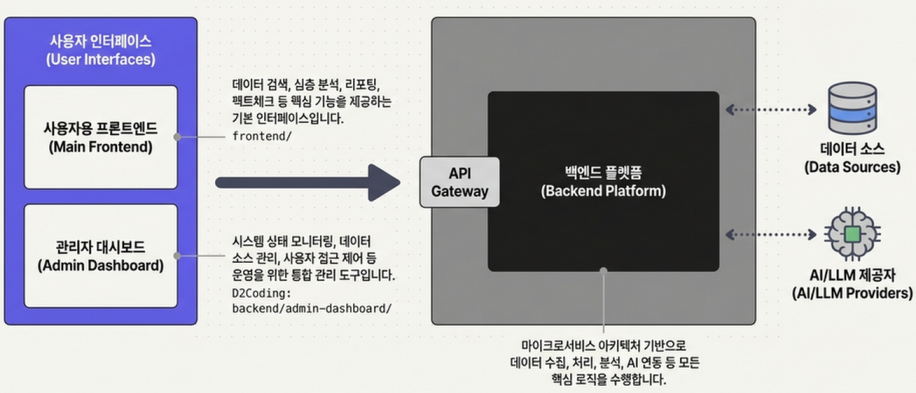

메인 프론트엔드와 Admin Dashboard가 API Gateway를 통해 백엔드 플랫폼과 상호작용합니다.

### 서비스 플로우

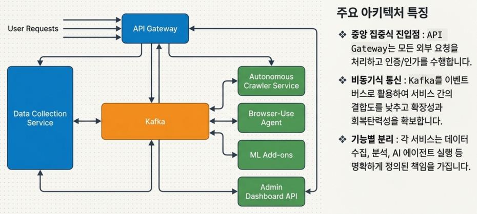

API Gateway → Kafka → 각 백엔드 서비스 간 데이터 플로우와 중앙 집중 인증 구조를 보여줍니다.

### API Gateway 보안

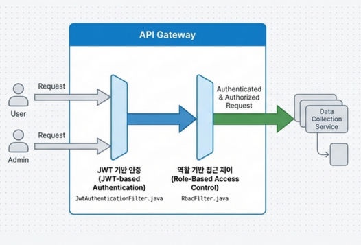

`JwtAuthenticationFilter`와 `RbacFilter`를 통한 인증/인가 단계 상세도입니다.

### 데이터 수집 계층

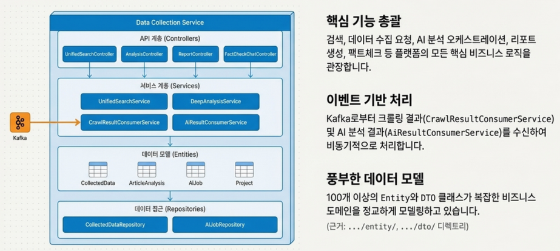

Controller/Service/Entity/Repository 계층과 Kafka 기반 이벤트 처리 방식을 도식화했습니다.

### Kafka 데이터 플로우


crawl/search 메시지 토픽별 흐름과 소비자 서비스(ConsumerService)의 역할을 설명합니다.

### 크롤러 파이프라인


Brave/Perplexity/Tavily 등 외부 검색 API와 Captcha 솔버, Stealth 모듈을 포함한 크롤링 오케스트레이션 절차입니다.

### Browser-Use AI 에이전트

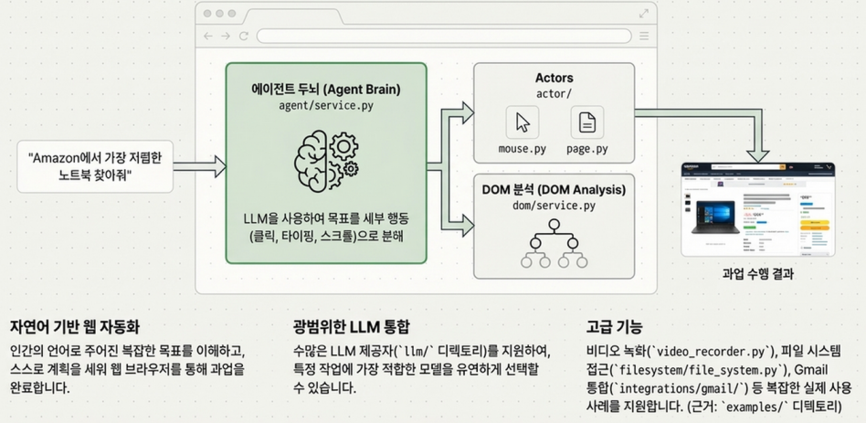

자연어 명령을 LLM이 행위 계획으로 변환하고 DOM 분석·액터 모듈을 통해 브라우저를 제어하는 과정을 보여줍니다.

### LLM 프로바이더 허브

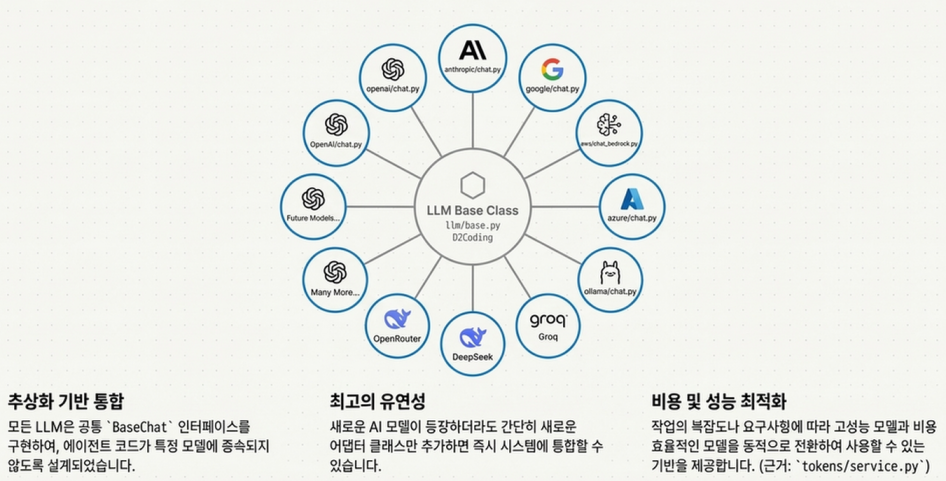

`llm/base.py`가 OpenAI, Anthropic, Bedrock, Groq, DeepSeek 등 다수의 LLM을 공통 인터페이스로 연결하는 구조입니다.

### ML 애드온 & MCP

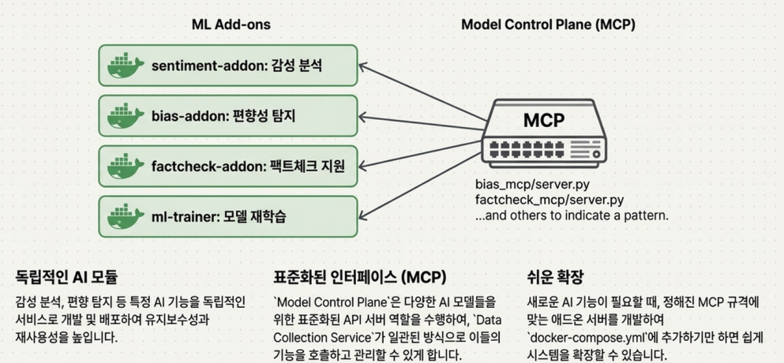

sentiment/bias/factcheck 애드온과 MCP 서버가 표준화된 API로 통합되는 방식을 도식화했습니다.

### Admin Dashboard 구조


React/TS 기반 관리 UI와 FastAPI 라우터 간 API 호출 관계 및 운영 기능을 소개합니다.

---

## ☁️ AWS 클라우드 인프라

### AWS 아키텍처 개요

NewsInsight는 AWS 완전 관리형 서비스를 활용하여 고가용성과 확장성을 보장합니다.

### VPC 네트워크 구성

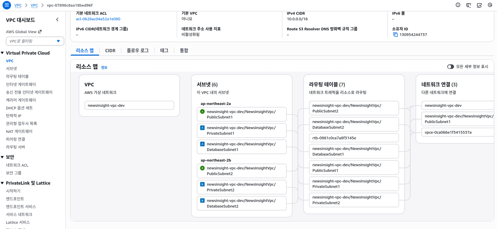

- **Region**: ap-northeast-2 (Seoul)
- **VPC CIDR**: 10.0.0.0/16
- **가용 영역**: ap-northeast-2a, ap-northeast-2c

#### 서브넷 구성

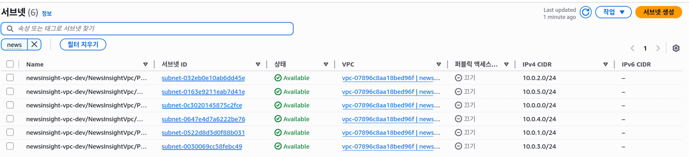

| 서브넷 | CIDR | 가용 영역 | 용도 |
|--------|------|-----------|------|
| Public Subnet 1 | 10.0.0.0/24 | ap-northeast-2a | ALB, NAT Gateway |
| Public Subnet 2 | 10.0.1.0/24 | ap-northeast-2c | ALB (HA) |
| Private Subnet 1 | 10.0.10.0/24 | ap-northeast-2a | Application Servers |
| Private Subnet 2 | 10.0.11.0/24 | ap-northeast-2c | RDS, DocumentDB |

#### 라우팅 테이블


- **Public Route Table**: Internet Gateway 연결
- **Private Route Table**: NAT Gateway를 통한 아웃바운드 트래픽

### 네트워크 게이트웨이

#### Internet Gateway

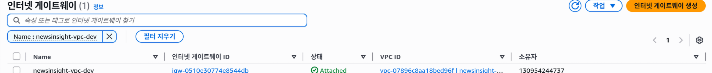

Public Subnet의 인터넷 연결을 제공합니다.

#### NAT Gateway

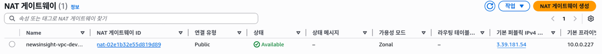

Private Subnet의 아웃바운드 인터넷 연결을 제공합니다.

### EC2 인스턴스

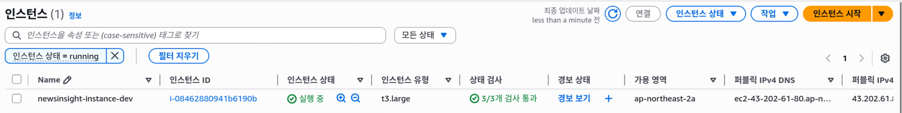

- **Instance Type**: t3.large
- **OS**: Ubuntu 22.04 LTS
- **Availability Zone**: ap-northeast-2a
- **Private IP**: 10.0.0.16
- **Public IP**: Elastic IP 할당

#### Elastic IP

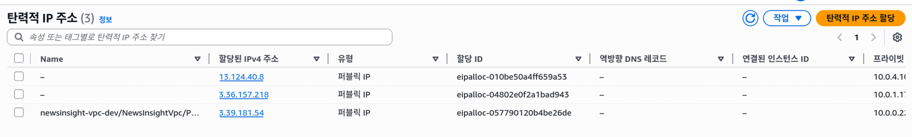

고정 공인 IP 주소를 통한 안정적인 외부 접근을 제공합니다.

#### EBS 볼륨


- **Type**: gp3 (General Purpose SSD)
- **Size**: 30 GB
- **IOPS**: 3000
- **Throughput**: 125 MB/s

### Application Load Balancer

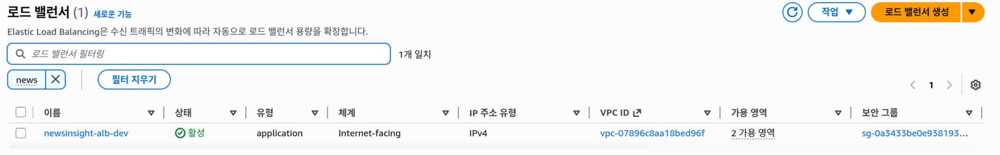

- **DNS**: newsinsight-alb-dev-1262924076.ap-northeast-2.elb.amazonaws.com
- **Protocol**: HTTP (Port 80)
- **Target Groups**: Frontend, API Gateway, Admin Dashboard

#### 대상 그룹

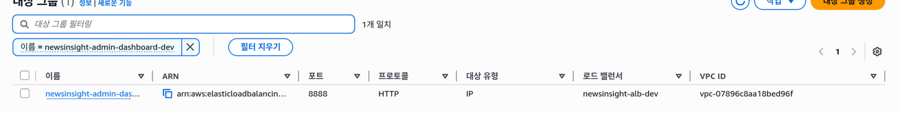

| 대상 그룹 | 포트 | 헬스 체크 경로 |
|-----------|------|----------------|
| frontend-tg | 8080 | / |
| api-gateway-tg | 8000 | /actuator/health |
| admin-dashboard-tg | 8888 | /health |

### 보안 그룹

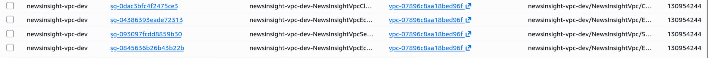

#### ALB Security Group
- Inbound: 0.0.0.0/0:80 (HTTP)
- Outbound: All traffic

#### Application Security Group
- Inbound: ALB Security Group → 8000, 8080, 8888
- Inbound: SSH (22) from specific IP
- Outbound: All traffic

#### Database Security Group
- Inbound: Application Security Group → 5432 (PostgreSQL), 27017 (MongoDB)
- Outbound: All traffic

### 관리형 데이터베이스

#### Aurora PostgreSQL

- **Endpoint**: newsinsight-postgres-dev.cluster-cnuocikwqyi6.ap-northeast-2.rds.amazonaws.com:5432
- **Engine**: Aurora PostgreSQL 15.x
- **Instance Class**: db.t3.medium
- **Storage**: Auto-scaling (10GB ~ 100GB)
- **Multi-AZ**: Enabled

#### DocumentDB (MongoDB Compatible)

- **Endpoint**: newsinsight-docdb-dev.cluster-cnuocikwqyi6.ap-northeast-2.docdb.amazonaws.com:27017
- **Engine**: DocumentDB 5.0
- **Instance Class**: db.t3.medium
- **Storage**: 10GB
- **Backup Retention**: 7 days

#### ElastiCache Redis

- **Endpoint**: master.newsinsight-redis-dev.k31okg.apn2.cache.amazonaws.com:6379
- **Engine**: Redis 7.0.7
- **Node Type**: cache.t3.micro
- **TLS**: Enabled (In-Transit Encryption)
- **Auth Token**: Enabled

### Container Registry (ECR)

- **Registry**: 130954244737.dkr.ecr.ap-northeast-2.amazonaws.com
- **Repositories**:
  - newsinsight/frontend:latest (55.6MB)
  - newsinsight/api-gateway:latest (255MB)
  - newsinsight/admin-dashboard:latest (442MB)

### 인프라 비용 최적화

- **Auto Scaling**: Keda를 통한 Kafka 워커 자동 확장
- **Spot Instances**: 비프로덕션 환경에서 활용
- **Reserved Instances**: RDS, ElastiCache 예약 인스턴스
- **S3 Lifecycle**: 로그 및 백업 데이터 자동 아카이빙

---

## 📦 서비스 구성

### Module Directory Map

| 서비스/컴포넌트 | 경로 | 주요 역할 | 기술 스택 |
| --- | --- | --- | --- |
| **api-gateway-service** | `backend/api-gateway-service/` | 단일 진입점, 라우팅, JWT 인증, RBAC | Java, Spring Boot, Gradle |
| **admin-dashboard** | `backend/admin-dashboard/` | 시스템 자원 관리, 헬스 모니터링, 감사 로그 | FastAPI, React, TypeScript |
| **autonomous-crawler-service** | `backend/autonomous-crawler-service/` | 자율 크롤링, 검색 API 연동, 캡챠 우회 | Python, Kafka, Celery |
| **browser-use** | `backend/browser-use/` | AI 브라우저 에이전트, 인간 수준 자동화 | Python, Playwright, Go |
| **data-collection-service** | `backend/data-collection-service/` | 하이브리드 검색, 팩트체크, 리포트 생성 | Java, Spring Boot, Kafka |
| **ml-addons** | `backend/ml-addons/` | 편향·팩트체크·감성 분석 ML 플러그인 | Python, Flask/FastAPI |
| **mcp** | `mcp/` | 모델 제어, AI 에이전트, 학습 파이프라인 | Python, MCP SDK |
| **frontend** | `frontend/` | SmartSearch UI, 대시보드, 챗봇 인터페이스 | React, TypeScript, Vite |

### AI Report 화면

#### AI 요약 모달


SmartSearch 결과를 기반으로 생성되는 AI 요약 모달입니다. 핵심 주장과 검증 상태를 한눈에 보여줍니다.

#### 데이터 포인트


세부 데이터 포인트(사실·출처·검증 수준)를 테이블로 제공하여 추적 가능성을 높입니다.

#### 결론 및 분석


다양한 관점, 주의사항, 결론 섹션으로 구성된 최종 분석 패널입니다.

### 서비스 상세

#### 1. API Gateway Service

**역할**: 모든 외부 요청을 내부 마이크로서비스로 전달하고 인증/인가를 중앙 집중화

- JWT 인증 필터
- RBAC 기반 권한 관리
- Redis 기반 Rate Limiting
- Consul 서비스 디스커버리

#### 2. Data Collection Service

**역할**: 플랫폼의 두뇌 역할을 수행하는 핵심 서비스

- **하이브리드 검색**: `VectorSearchService`, `HybridRankingService`
- **팩트체크**: 다중 학술 DB 통합 (Semantic Scholar, PubMed, CORE, CrossRef, OpenAlex)
- **RRF 융합**: 다중 쿼리 병렬 검색 및 Reciprocal Rank Fusion
- **PDF 리포트**: 차트 캡처와 AI 요약 결합
- **워크스페이스**: Project/Workspace 기반 협업

#### 3. Autonomous Crawler Service

**역할**: 정책 기반 자율 크롤링 및 데이터 수집

- Brave/Perplexity/Tavily 검색 API 통합
- Kafka 기반 비동기 처리
- Camoufox/Nopecha 캡챠 우회
- 중복 제거 및 품질 필터링

#### 4. Browser-Use Service

**역할**: AI 기반 브라우저 자동화

- 다중 LLM 연동 (OpenAI, Anthropic, Gemini, Bedrock, Groq, Ollama)
- Playwright 기반 DOM 분석
- 세션 유지 및 영상 녹화
- 인터벤션 워크플로우

#### 5. Admin Dashboard

**역할**: 시스템 운영 및 관리

- FastAPI + React/TS 스택
- LLM 프로바이더 관리
- ML 애드온 제어
- 헬스 모니터링
- Kafka 작업 제어

#### 6. ML Add-ons & MCP

**역할**: 플러그인 방식 ML 모델 및 AI 에이전트 관리

- 편향/감성/팩트체크 모델
- MCP 서버 기반 모델 제어
- 학습 파이프라인 자동화

---

## 💻 기술 스택

### Frontend

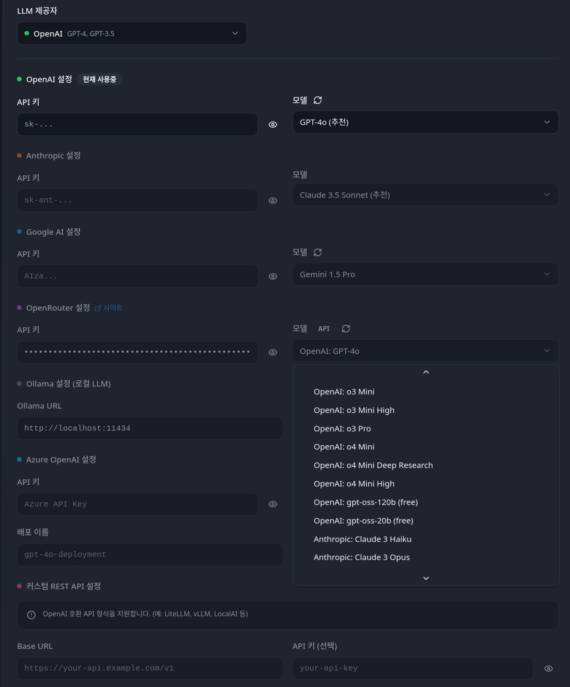

- **Framework**: React 18 + TypeScript
- **Build Tool**: Vite
- **Styling**: Tailwind CSS + shadcn/ui
- **State Management**: React Query + Context API
- **Charts**: Recharts, D3.js
- **Real-time**: Server-Sent Events (SSE)

### Backend

- **Language**: Java 21, Python 3.10+, Go 1.21+
- **Framework**: Spring Boot 3.2, FastAPI, Gin
- **ORM**: Spring Data JPA, Hibernate
- **Messaging**: Apache Kafka
- **Cache**: Redis
- **Database**: PostgreSQL, MongoDB

### AI & ML

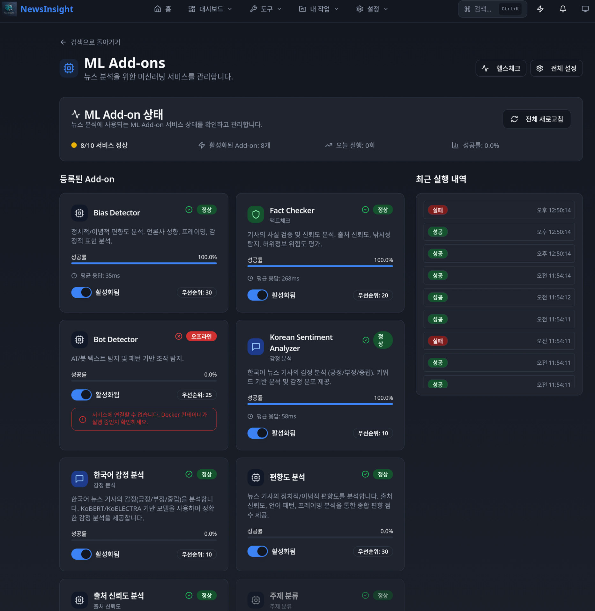

- **LLM**: OpenAI, Anthropic, Google Gemini, AWS Bedrock, Groq, DeepSeek, Ollama
- **ML Framework**: PyTorch, TensorFlow, scikit-learn
- **NLP**: Transformers, spaCy, KoNLPy
- **Vector DB**: Milvus, Qdrant

### Infrastructure

- **Cloud**: AWS (EC2, RDS, DocumentDB, ElastiCache, ALB, ECR)
- **Container**: Docker, Docker Compose
- **Orchestration**: Kubernetes, Keda
- **Service Discovery**: Consul
- **CI/CD**: GitHub Actions, AWS CodePipeline

### DevOps

- **Monitoring**: Prometheus, Grafana
- **Logging**: ELK Stack (Elasticsearch, Logstash, Kibana)
- **Tracing**: Jaeger
- **Security**: Vault, AWS Secrets Manager

---

## 🚀 시작하기

### 사전 요구사항

- **Node.js** 18+ / Bun (프론트엔드)
- **Java** 17+ & Gradle Wrapper (Spring 서비스)
- **Python** 3.10+ (crawler, browser-use, ml-addons)
- **Docker Desktop** (로컬 통합 실행용)
- **Kafka & Consul** (docker-compose 활용 권장)

### 로컬 개발 환경 설정

#### 1. 저장소 클론

```bash
git clone https://github.com/choisimo/NewsInsight.git
cd NewsInsight
```

#### 2. 환경 변수 설정

```bash
# AWS 환경 변수 (선택사항)
cp aws/.env.aws.example aws/.env.aws

# 각 서비스별 환경 변수 설정
cp backend/data-collection-service/.env.example backend/data-collection-service/.env
```

#### 3. 인프라 서비스 시작 (Docker Compose)

```bash
# Kafka, Consul, PostgreSQL, MongoDB, Redis 시작
docker-compose -f etc/docker/docker-compose.production.yml up -d
```

#### 4. Frontend 실행

```bash
cd frontend
bun install    # 또는 npm install
bun dev        # http://localhost:5173
```

#### 5. Data Collection Service 실행

```bash
cd backend/data-collection-service
./gradlew bootRun
```

#### 6. API Gateway 실행

```bash
cd backend/api-gateway-service
./gradlew bootRun
```

#### 7. Autonomous Crawler 실행

```bash
cd backend/autonomous-crawler-service
poetry install
poetry run python src/main.py
```

### Docker Compose로 전체 스택 실행

```bash
# 전체 서비스 시작
docker-compose up -d

# 로그 확인
docker-compose logs -f

# 서비스 중지
docker-compose down
```

### AWS 배포

```bash
# AWS CDK 배포
cd aws/cdk
npm install
cdk deploy

# 또는 스크립트 사용
./scripts/deploy-aws.sh
```

---

## 📚 문서

### 아키텍처 문서

- [시스템 아키텍처 개요](./docs/overview/README.md)
- [API 명세서](./ENDPOINTS.md)
- [데이터 모델](./docs/backend/data-collection-service/)

### 서비스별 문서

- [API Gateway](./backend/api-gateway-service/README.md)
- [Data Collection Service](./backend/data-collection-service/README.md)
- [Autonomous Crawler](./backend/autonomous-crawler-service/README.md)
- [Browser-Use Agent](./backend/browser-use/README.md)
- [Admin Dashboard](./backend/admin-dashboard/README.md)

### 인프라 가이드

- [AWS 배포 가이드](./aws/README.md)
- [Kubernetes 배포](./etc/k8s/README.md)
- [Cloudflare Tunnel 설정](./etc/infra-guides/CLOUDFLARE_TUNNEL_CHECKLIST.md)
- [Consul 마이그레이션](./etc/infra-guides/CONSUL_MIGRATION.md)

### 개발 가이드

- [프론트엔드 개발](./frontend/README.md)
- [백엔드 개발](./docs/backend/)
- [ML 모델 개발](./backend/ml-addons/README.md)

---

## 🤝 기여하기

이 프로젝트는 활발히 발전 중이며, 다음과 같은 기여를 환영합니다:

1. **문서화**: 신규 모듈/워크플로우 추가 시 README 또는 `/docs` 업데이트
2. **이슈 등록**: 버그/개선 제안은 GitHub Issues에 서비스별 라벨 추가
3. **Pull Request**: lint & 테스트 통과 후 PR 제출, 관련 서비스 담당 리뷰어 지정

### 개발 워크플로우

```bash
# Feature 브랜치 생성
git checkout -b feature/your-feature-name

# 변경사항 커밋
git commit -m "feat: add new feature"

# Push 및 PR 생성
git push origin feature/your-feature-name
```

---

## 📄 라이선스

This project is licensed under the MIT License - see the [LICENSE](LICENSE) file for details.

---

## 📞 문의 및 지원

- **Issues**: [GitHub Issues](https://github.com/choisimo/NewsInsight/issues)
- **Discussions**: [GitHub Discussions](https://github.com/choisimo/NewsInsight/discussions)
- **Email**: support@newsinsight.io

---

<div align="center">

**NewsInsight Platform** - AI 기반 뉴스 인텔리전스의 미래

Made with ❤️ by NewsInsight Team

</div>

## Getting Started

### Prerequisites

- Node.js 18+ / Bun (프론트엔드)
- Java 17+ & Gradle Wrapper (Spring 서비스)
- Python 3.10+ (crawler, browser-use, ml-addons)
- Docker Desktop (optional, 로컬 통합 실행용)
- Kafka & Consul (로컬 테스트 시 docker-compose 활용 권장)

### Common Setup

```bash
git clone https://github.com/choisimo/NewsInsight.git
cd NewsInsight
```

#### Frontend

```bash
cd frontend
bun install    # 또는 npm install
bun dev        # http://localhost:5173
```

#### Data Collection Service

```bash
cd backend/data-collection-service
./gradlew bootRun
```

#### Autonomous Crawler

```bash
cd backend/autonomous-crawler-service
poetry install
poetry run python src/main.py
```

> 다른 서비스들도 각 디렉토리에서 `README.md` 혹은 `docker-compose` 스크립트를 확인하세요.  
> 전체 스택을 띄울 때는 `docker-compose` 혹은 `etc/k8s/` 배포 스크립트를 참고하면 됩니다.

## Development Tips

- Kafka/Consul 의존성이 있는 모듈은 `scripts/` 디렉토리의 헬퍼 스크립트로 쉽게 부트스트랩할 수 있습니다.
- 프론트엔드와 백엔드를 동일한 포트 도메인에서 실행할 때는 `frontend/vite.config.ts` 프록시 설정을 활용하세요.
- FactCheck 챗, PDF Export 등 SSE/다운로드 API는 인증 설정(`backend/data-collection-service/.../SecurityConfig.java`)을 확인해 주세요.

## Contributing & Support

이 레포는 활발히 발전 중이며, 다음과 같은 기여를 환영합니다.

1. **문서화**: 신규 모듈/워크플로우를 추가했다면 README 혹은 `/docs`에 업데이트해주세요.
2. **이슈 등록**: 버그/개선 제안은 GitHub Issues에 서비스별 라벨을 붙여 올려주세요.
3. **PR 가이드**: lint & 테스트 통과 후 PR을 올리고, 관련 서비스 담당 리뷰어를 지정합니다.

문의나 제안은 Issues/Discussions를 통해 남겨 주세요. NewsInsight 팀에 오신 것을 환영합니다!
