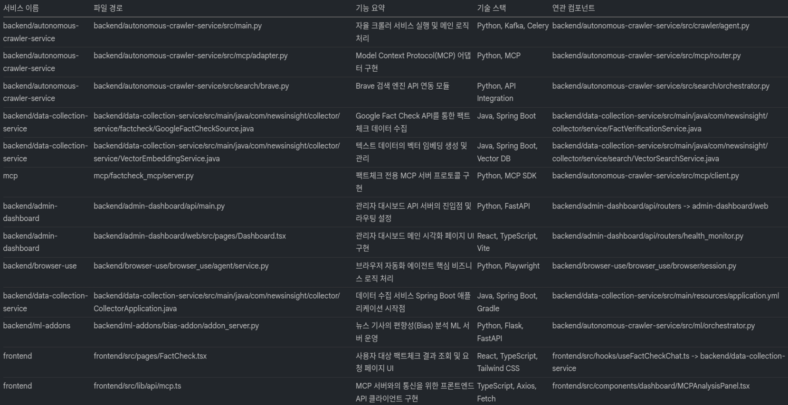
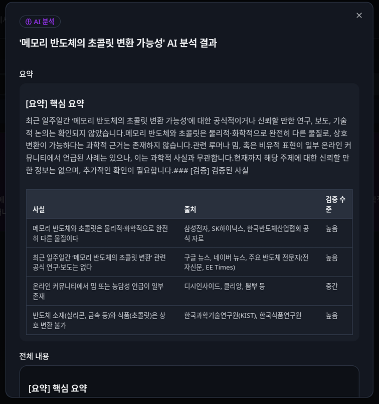
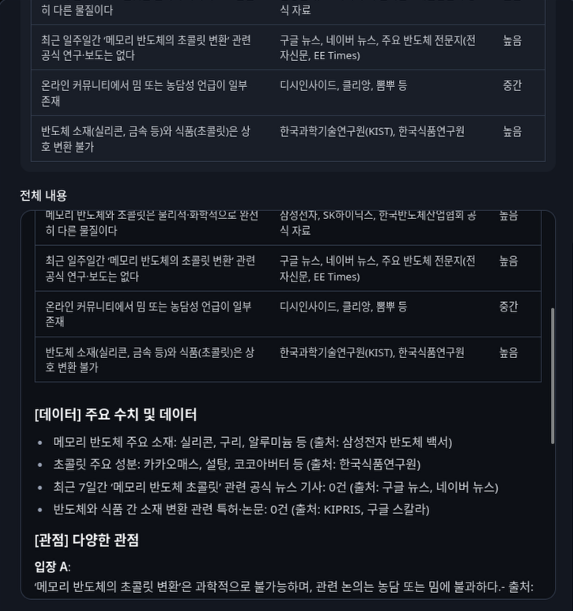
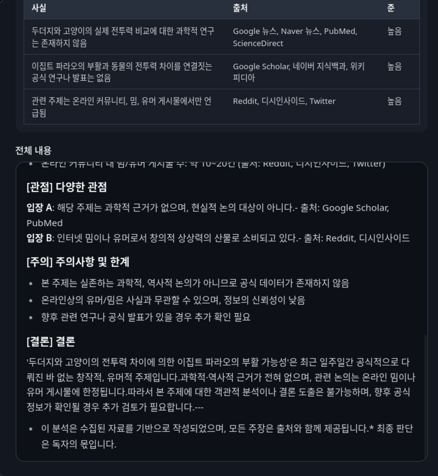
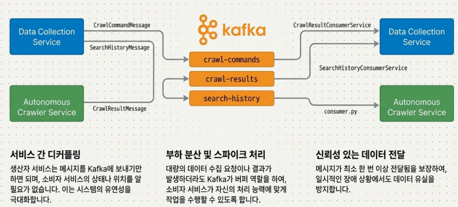
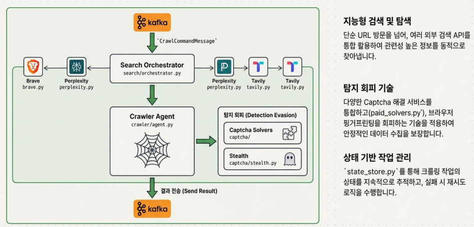
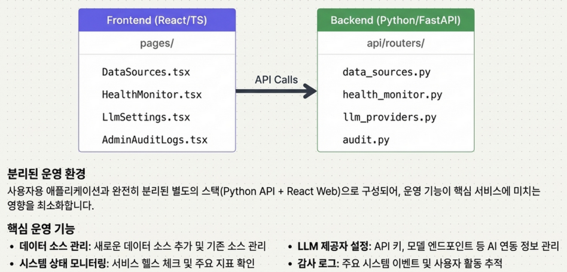

# NewsInsight Platform

뉴스, 팩트체킹, 브라우저 자동화, AI 분석 기능을 하나의 데이터 인텔리전스 워크벤치로 통합한 플랫폼입니다.  
Kafka 기반 마이크로서비스 아키텍처를 채택하고 있으며, 자율 크롤링–하이브리드 검색–AI 리포팅까지의 파이프라인을 전부 포함합니다.

## Architecture at a Glance



플랫폼은 API Gateway를 중심으로 다수의 백엔드 서비스와 MCP(모델 제어) 레이어, React 기반의 UI로 구성됩니다. 각 서비스는 컨테이너화되어 독립적으로 배포되며, Kafka/Consul을 통해 서로 연결됩니다.

## Module Directory Map

| 서비스/컴포넌트 | 경로 | 주요 역할 | 기술 스택 |
| --- | --- | --- | --- |
| **api-gateway-service** | `backend/api-gateway-service/` | 단일 진입점, 라우팅, JWT 인증, RBAC | Java, Spring Boot, Gradle |
| **admin-dashboard** | `backend/admin-dashboard/` | 시스템 자원 관리, 헬스 모니터링, 감사 로그 | FastAPI, React, TypeScript |
| **autonomous-crawler-service** | `backend/autonomous-crawler-service/` | 자율 크롤링, 검색 API 연동, 캡챠 우회 | Python, Kafka, Celery |
| **browser-use** | `backend/browser-use/` | AI 브라우저 에이전트, 인간 수준 자동화 | Python, Playwright, Go |
| **data-collection-service** | `backend/data-collection-service/` | 하이브리드 검색, 팩트체크, 리포트 생성 | Java, Spring Boot, Kafka |
| **ml-addons** | `backend/ml-addons/` | 편향·팩트체크·감성 분석 ML 플러그인 | Python, Flask/FastAPI |
| **mcp** | `mcp/` | 모델 제어, AI 에이전트, 학습 파이프라인 | Python, MCP SDK |
| **frontend** | `frontend/` | SmartSearch UI, 대시보드, 챗봇 인터페이스 | React, TypeScript, Vite |

> 위 표는 `모듈_설명.png`의 정보를 텍스트로 정리한 것입니다. 이미지와 함께 보며 서비스를 빠르게 파악할 수 있습니다.

## Visual Walkthrough

제품 데모에서 캡처한 핵심 화면을 통해 각 기능이 어떻게 연결되는지 빠르게 확인할 수 있습니다.

### AI Report Experience

-   
  SmartSearch 결과를 기반으로 생성되는 AI 요약 모달입니다. 핵심 주장과 검증 상태를 한눈에 보여줍니다.
-   
  세부 데이터 포인트(사실·출처·검증 수준)를 테이블로 제공하여 추적 가능성을 높입니다.
-   
  다양한 관점, 주의사항, 결론 섹션으로 구성된 최종 분석 패널입니다.

### System Architecture Snapshots

-   
  메인 프론트엔드와 Admin Dashboard가 API Gateway를 통해 백엔드 플랫폼과 상호작용하는 구성을 보여줍니다.
-   
  API Gateway–Kafka–각 백엔드 서비스 간 데이터 플로우와 중앙 집중 인증 구조를 요약합니다.
-   
  `JwtAuthenticationFilter`와 `RbacFilter`를 통한 인증/인가 단계 상세도입니다.
-   
  Controller/Service/Entity/Repository 계층과 Kafka 기반 이벤트 처리 방식을 도식화했습니다.
-   
  crawl/search 메시지 토픽별 흐름과 소비자 서비스(ConsumerService)의 역할을 설명합니다.

### Autonomous Crawler & Browser Agents

-   
  Brave/Perplexity/Tavily 등 외부 검색 API와 Captcha 솔버, Stealth 모듈을 포함한 크롤링 오케스트레이션 절차입니다.
-   
  자연어 명령을 LLM이 행위 계획으로 변환하고 DOM 분석·액터 모듈을 통해 브라우저를 제어하는 과정을 보여줍니다.

### AI/LLM Orchestration

-   
  `llm/base.py`가 OpenAI, Anthropic, Bedrock, Groq, DeepSeek 등 다수의 LLM을 공통 인터페이스로 연결하는 구조입니다.
-   
  sentiment/bias/factcheck 애드온과 MCP 서버가 표준화된 API로 통합되는 방식을 도식화했습니다.

### Operations Console

-   
  React/TS 기반 관리 UI와 FastAPI 라우터 간 API 호출 관계 및 운영 기능을 소개합니다.

## Core Services

### 1. API Gateway Service

- 역할: 모든 외부 요청을 내부 마이크로서비스로 전달하고 인증/인가를 중앙 집중화합니다.
- 특징: `JwtAuthenticationFilter`, `RbacFilter`를 통해 RBAC를 일관되게 적용합니다.

### 2. Admin Dashboard

- 구성: FastAPI 기반 관리 API + React/TS 웹 UI.
- 기능: 데이터 소스·LLM 공급자·ML 애드온 관리, 헬스 모니터, Kafka 작업 제어 등 운영 도구.

### 3. Autonomous Crawler Service

- 기능: 정책 기반 자율 크롤링, Brave/Perplexity/Tavily 등 외부 검색 API 연동.
- 기술: Kafka Producer/Consumer로 대규모 작업을 비동기 처리, camoufox/nopecha로 캡챠 해결.

### 4. Data Collection Service (`newsinsight/collector`)

- 플랫폼의 두뇌 역할을 수행하는 Spring Boot 애플리케이션.
- 주요 모듈:
  - **AI & 검색**: `VectorSearchService`, `HybridRankingService`로 시맨틱+키워드 검색 제공.
  - **팩트체크**: Google Fact Check API, Wikipedia, OpenAlex 등을 활용한 신뢰도 검증.
  - **리포트**: `PdfExportService`가 차트 캡처와 AI 요약을 결합해 PDF를 생성.
  - **워크스페이스**: Project/Workspace 엔티티로 협업과 데이터 조직을 지원.

### 5. Browser-Use Service

- 다중 LLM(OpenAI, Anthropic, Gemini, Bedrock, Groq, Ollama 등)과 연동되는 AI 브라우저 에이전트.
- Playwright 기반으로 DOM 분석, 세션 유지, 영상 녹화, 인터벤션 워크플로우 등을 제공.

### 6. ML Add-ons & MCP

- `ml-addons`: 편향/감성/팩트체크 모델을 별도 마이크로서비스로 운영해 확장성 확보.
- `mcp`: MCP 서버를 통해 AI 에이전트, 모델 학습, 파이프라인 작업을 통제.

## Frontend Experience

- **기술 스택**: React + TypeScript + Vite + Tailwind CSS.
- **주요 화면**:
  - SmartSearch/DeepSearch/ParallelSearch: 윈도별 하이브리드 검색과 실시간 SSE 스트림.
  - FactCheckChatbot: 데이터-콜렉션 서비스의 팩트체크 챗 API와 연동.
  - Live/Project Dashboard: `SentimentChart`, `KeywordCloud`, `TrendLineChart` 등 시각화 컴포넌트 제공.
- **상태 관리**: React Query 유사 커스텀 훅(`useAiJobs`, `useCollectedData` 등) + Context API.

## AI & ML Integration

- LLM 파이프라인: 쿼리 의도 분석, 주장 추출, 요약, 브라우저 자동화 등 전반에 LLM 활용.
- 플러그형 애드온: ml-addons 서버를 필요 시 온디맨드 배포해 특정 분석 기능을 확장.
- MLOps: `ml-trainer`, MCP 서버를 통해 학습·추론 작업을 스케줄링하고 자동화합니다.

## Infrastructure & Deployment

- **Containerization**: Docker / docker-compose.
- **Orchestration**: Kubernetes manifests under `etc/k8s/`, Keda로 Kafka 워커 자동 확장.
- **Messaging**: Apache Kafka.
- **Config & Discovery**: Consul (`application-local-consul.yml`).
- **Build Tools**: Gradle(backend), Bun/PNPM/NPM(frontend), Python virtual environments.

## Getting Started

### Prerequisites

- Node.js 18+ / Bun (프론트엔드)
- Java 17+ & Gradle Wrapper (Spring 서비스)
- Python 3.10+ (crawler, browser-use, ml-addons)
- Docker Desktop (optional, 로컬 통합 실행용)
- Kafka & Consul (로컬 테스트 시 docker-compose 활용 권장)

### Common Setup

```bash
git clone https://github.com/choisimo/NewsInsight.git
cd NewsInsight
```

#### Frontend

```bash
cd frontend
bun install    # 또는 npm install
bun dev        # http://localhost:5173
```

#### Data Collection Service

```bash
cd backend/data-collection-service
./gradlew bootRun
```

#### Autonomous Crawler

```bash
cd backend/autonomous-crawler-service
poetry install
poetry run python src/main.py
```

> 다른 서비스들도 각 디렉토리에서 `README.md` 혹은 `docker-compose` 스크립트를 확인하세요.  
> 전체 스택을 띄울 때는 `docker-compose` 혹은 `etc/k8s/` 배포 스크립트를 참고하면 됩니다.

## Development Tips

- Kafka/Consul 의존성이 있는 모듈은 `scripts/` 디렉토리의 헬퍼 스크립트로 쉽게 부트스트랩할 수 있습니다.
- 프론트엔드와 백엔드를 동일한 포트 도메인에서 실행할 때는 `frontend/vite.config.ts` 프록시 설정을 활용하세요.
- FactCheck 챗, PDF Export 등 SSE/다운로드 API는 인증 설정(`backend/data-collection-service/.../SecurityConfig.java`)을 확인해 주세요.

## Contributing & Support

이 레포는 활발히 발전 중이며, 다음과 같은 기여를 환영합니다.

1. **문서화**: 신규 모듈/워크플로우를 추가했다면 README 혹은 `/docs`에 업데이트해주세요.
2. **이슈 등록**: 버그/개선 제안은 GitHub Issues에 서비스별 라벨을 붙여 올려주세요.
3. **PR 가이드**: lint & 테스트 통과 후 PR을 올리고, 관련 서비스 담당 리뷰어를 지정합니다.

문의나 제안은 Issues/Discussions를 통해 남겨 주세요. NewsInsight 팀에 오신 것을 환영합니다!
