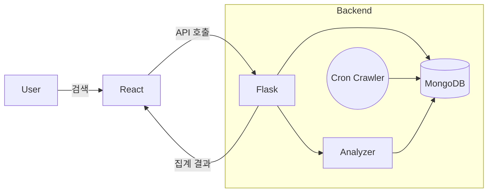

# 아이디어 상세 - 수빈 (뉴스 인사이트)

## 기본 정보

| 항목 | 내용 |
| --- | --- |
| :--- | :--- |
| **프로젝트명** | 뉴스 인사이트 (News Insight): 실시간 여론 분석 대시보드 |
| **제출일** | 2025년 9월 28일 |
| **예상 개발기간** | 3개월 (12주) |

---

## 1. 프로젝트 개요

### 1.1 한줄 요약

뉴스 기사 크롤링과 자연어 처리(NLP) 기술을 활용하여, 특정 키워드(기업, 인물, 주제 등)에 대한 여론 동향과 핵심 이슈를 시각적으로 분석해 제공하는 웹 서비스

### 1.2 문제 정의 및 해결방안

| 구분 | 내용 |
| --- | --- |
| :--- | :--- |
| **해결할 문제** | 1. **정보 과부하**: 특정 주제에 대한 여론을 파악하기 위해 수많은 뉴스를 직접 읽고 판단해야 하는 비효율성
2. **편향된 정보 습득**: 사용자의 성향에 따라 특정 논조의 기사만 소비하여 객관적인 여론 파악의 어려움
3. **핵심 이슈 파악의 어려움**: 관련 뉴스들 속에서 현재 가장 주목받는 핵심 키워드가 무엇인지 한눈에 알기 어려움 |
| **대상 사용자** | - **투자자**: 특정 기업의 평판이나 리스크를 빠르게 파악하고 싶은 개인/기관 투자자
- **마케터/홍보 담당자**: 자사 및 경쟁사의 미디어 노출 현황과 여론 반응을 모니터링해야 하는 실무자
- **언론인/연구원**: 특정 사회적 이슈나 인물에 대한 여론의 흐름을 데이터 기반으로 분석하고 싶은 전문가
- **일반 대중**: 관심 있는 주제에 대한 긍정/부정 여론을 객관적으로 확인하고 싶은 사용자 |
| **해결 방안** | 1. **자동화된 데이터 수집 및 분석**: 포털 뉴스 API를 통해 관련 기사를 자동으로 수집하고, 기계학습 모델로 긍정/부정 감성 분석을 수행
2. **객관적인 데이터 시각화**: 분석된 긍/부정 비율을 원형 차트나 막대그래프로 명확하게 제시
3. **핵심 키워드 추출**: 텍스트 마이닝 기술(TF-IDF 등)을 이용해 기사 본문에서 핵심 키워드를 추출하고, 빈도에 따라 워드 클라우드 형태로 시각화하여 직관적인 인사이트 제공 |
| **기대 효과** | - **의사결정 시간 단축**: 사용자는 몇 번의 클릭만으로 특정 주제에 대한 여론을 신속하게 파악하여 의사결정에 활용 가능
- **데이터 기반 소통**: 객관적인 데이터와 시각화 자료를 통해 내부 보고나 토론 시 효과적인 근거로 활용
- **새로운 인사이트 발견**: 개인이 놓칠 수 있는 핵심 이슈나 연관 키워드를 발견하여 더 깊이 있는 분석 유도 |

---

## 2. 기술적 세부사항

### 2.1 기술 스택

| 영역 | 기술 | 선택 이유 | 난이도 |
| --- | --- | --- | --- |
| :--- | :--- | :--- | :--- |
| **Frontend** | React.js, Chart.js | - 동적인 UI/UX 구축에 용이하며, 컴포넌트 기반 개발로 유지보수가 편리함
- `Chart.js`: 다양한 데이터 시각화 차트를 손쉽게 구현 가능 | 중 |
| **Backend** | Python (Flask) | - `Scrapy`, `BeautifulSoup` 등 데이터 크롤링 라이브러리가 풍부함
- `KoNLPy`, `Scikit-learn` 등 강력한 자연어 처리 및 머신러닝 라이브러리 생태계 보유
- `Flask`: 가볍고 빠르게 API 서버를 구축하기에 적합 | 중 |
| **Database** | MongoDB | - 뉴스 기사와 같이 비정형적인 텍스트 데이터를 저장하고 조회하기에 유연한 구조
- Python과의 연동이 간편함 | 하 |
| **Cloud/AWS** | AWS EC2, S3 | - `EC2`: 웹 애플리케이션 서버를 배포하고 운영하기 위한 업계 표준
- `S3`: 수집된 원본 데이터나 로그 파일 등을 저렴하게 저장 (선택 사항) | 중 |
| **기타** | KoNLPy, Scikit-learn, Nginx | - `KoNLPy`: 한국어 형태소 분석 및 명사 추출에 필수적
- `Scikit-learn`: 감성 분석을 위한 간단한 분류 모델(예: Naive Bayes) 구현 및 TF-IDF 계산
- `Nginx`: 정적 파일 서빙 및 서버 부하 분산을 위한 리버스 프록시 | 중 |

### 2.2 시스템 구조

- **사용자**: 웹 브라우저를 통해 서비스에 접속하고 키워드 검색
- **프론트엔드 (React)**: 사용자 요청을 백엔드 API로 전달하고, 받은 데이터를 차트와 워드 클라우드로 시각화
- **백엔드 (Flask)**: API 요청을 받아 데이터베이스 조회 또는 분석 모듈 실행
- **분석 모듈 (Python)**:
    - **크롤러**: 스케줄에 따라 또는 요청 시 뉴스 포털에서 기사 수집
    - **NLP 분석기**: 수집된 기사의 긍/부정 분석 및 핵심 키워드 추출
- **데이터베이스 (MongoDB)**: 수집된 기사 원문과 분석 결과를 저장

### 2.3 클라우드 활용 방안

| 클라우드 서비스 | 활용 목적 | 중요도 |
| --- | --- | --- |
| :--- | :--- | :--- |
| **AWS EC2** | Flask 백엔드 서버 및 React 빌드 파일 배포. 24시간 서비스 운영. | ★★★★★ |
| **AWS RDS/DocumentDB** | 데이터베이스 서버 운영. (초기에는 EC2에 MongoDB를 직접 설치하는 방식으로 비용 절감 가능) | ★★★★☆ |
| **Amazon S3** | 정적 파일(이미지, CSS) 서빙, 수집 데이터 백업용 스토리지 | ★★★☆☆ |
| **CloudWatch** | 서버 모니터링 및 로그 관리 | ★★★☆☆ |

---

## 3. 구현 계획

### 3.1 주요 기능

| 우선순위 | 기능명 | 상세 설명 | 예상 소요시간 |
| --- | --- | --- | --- |
| :--- | :--- | :--- | :--- |
| **1** | **키워드 기반 뉴스 수집** | - 사용자가 키워드를 입력하면, 해당 키워드를 포함하는 최신 뉴스 기사 제목과 본문을 포털 사이트에서 수집하는 기능
- 중복 기사 필터링 | 2주 |
| **2** | **감성 분석 및 시각화** | - 수집된 기사 제목을 대상으로 긍정/부정/중립을 판단하는 분석 모델 구현
- 전체적인 긍/부정 비율을 원형 또는 막대 차트로 시각화 | 3주 |
| **3** | **핵심 키워드 추출 및 시각화** | - 모든 기사 본문에서 명사 등 핵심 품사를 추출하고, 빈도 분석(TF-IDF)을 통해 상위 키워드 선정
- 추출된 키워드를 워드 클라우드 형태로 시각화 | 2주 |
| **4** | **대시보드 UI 구현** | - 검색창, 분석 결과(기사 목록, 감성분석 차트, 워드클라우드)를 한 화면에 보여주는 통합 대시보드 페이지 개발 | 2주 |

### 3.2 개발 단계별 일정

| 단계 | 주요 작업 | 예상 기간 | 필요 역량 |
| --- | --- | --- | --- |
| :--- | :--- | :--- | :--- |
| **1단계** | **기획 및 설계** | 2주 | - 요구사항 정의
- 화면 기획(Wireframe)
- 시스템 아키텍처 및 DB 스키마 설계 |
| **2단계** | **핵심 기능 개발** | 6주 | - Python 뉴스 크롤러 개발
- 한국어 자연어 처리 모델 구현 (감성분석, 키워드 추출)
- 핵심 기능 API 개발 (Flask) |
| **3단계** | **통합 및 테스트** | 3주 | - 프론트엔드(React) UI 개발 및 API 연동
- 기능 통합 테스트 및 버그 수정
- 클라우드(AWS) 배포 환경 구축 |
| **4단계** | **배포 및 마무리** | 1주 | - 최종 배포 및 서비스 안정화
- 프로젝트 문서화 및 발표 자료 준비 |

---

## 4. 평가 및 검토

### 4.1 아이디어 장점

| 평가 영역 | 장점 | 점수 (1-5) |
| --- | --- | --- |
| :--- | :--- | :--- |
| **참신성** | 기존에 유사 서비스는 존재하지만, 특정 목적(포트폴리오, 학습)에 맞춰 핵심 기능을 경량화하고 UI/UX를 개선하여 차별화 가능 | 3 |
| **필요성** | 정보의 홍수 속에서 데이터 기반의 빠르고 객관적인 여론 파악에 대한 수요는 꾸준히 증가하고 있음 | 4 |
| **구현가능성** | 오픈소스 라이브러리(KoNLPy, Scikit-learn)가 잘 갖춰져 있어, 핵심 로직 구현이 가능. 단, 한국어 자연어 처리의 난이도는 다소 있음. | 4 |
| **학습효과** | 풀스택 웹 개발(React, Flask), 데이터 수집(Crawling), 자연어 처리, 클라우드 배포까지 전 과정을 경험할 수 있어 학습 효과가 매우 높음 | 5 |

### 4.2 우려사항 및 위험요소

| 위험요소 | 영향도 | 대안/해결법 |
| --- | --- | --- |
| :--- | :--- | :--- |
| **뉴스 포털의 크롤링 차단** | 상 | - 직접 크롤링 대신 **네이버/다음 뉴스 API**를 우선적으로 활용 (API 키 발급 필요)
- 무리한 요청을 막기 위해 요청 간 시간 간격(delay) 설정 |
| **한국어 감성 분석의 정확도 문제** | 중 | - 초기에는 긍정/부정 단어 사전을 구축하는 간단한 방식으로 시작
- 정확도 향상이 필요할 경우, 공개된 한국어 리뷰 데이터셋으로 Naive Bayes, Logistic Regression 등 간단한 분류 모델을 학습시켜 적용 |
| **데이터 처리 속도 저하** | 하 | - 사용자가 검색을 요청할 때마다 실시간으로 분석하면 느릴 수 있음
- 인기 키워드는 미리 분석 결과를 캐싱(Caching)해두거나, 주기적으로 백그라운드에서 분석 작업을 수행하는 방식으로 개선 |

### 4.3 기대 성과

| 성과 지표 | 예상 결과 |
| --- | --- |
| :--- | :--- |
| **기능적 성과** | 키워드 검색 시 10초 내외로 관련 뉴스 기반의 감성 분석 차트와 워드 클라우드를 제공하는 웹 서비스 완성 |
| **기술적 학습** | - Python Flask 기반의 RESTful API 서버 설계 및 구축 능력
- React를 이용한 데이터 시각화 및 동적 웹 페이지 개발 능력
- 한국어 텍스트 데이터 전처리 및 자연어 처리 기본 모델 적용 능력
- AWS EC2를 이용한 기본적인 서비스 배포 및 운영 경험 |
| **사용자 가치** | 복잡한 뉴스 속에서 특정 주제에 대한 여론의 핵심을 직관적이고 빠르게 파악할 수 있는 가치 제공 |
| **팀 역량 향상** | 기획-설계-개발-배포 전 과정을 경험하며 프로젝트 관리 및 협업 능력 증진 |

---

## 5. 참고자료 및 벤치마킹

### 5.1 유사 서비스 분석

| 서비스명 | 주요 기능 | 장점 | 단점 | 우리와의 차이 |
| --- | --- | --- | --- | --- |
| :--- | :--- | :--- | :--- | :--- |
| **썸트렌드(SomeTrend)** | - 소셜 미디어(블로그, 트위터, 인스타그램) 데이터 기반 분석
- 연관어, 감성어, 언급량 추이 분석 | - 방대한 데이터 소스
- 고도화된 분석 기능 | - 유료 서비스
- 전문가용으로 기능이 다소 복잡 | - 우리는 **뉴스 데이터**에 집중
- 핵심 기능(감성, 키워드)만 제공하여 더 가볍고 직관적인 서비스 지향 |
| **Google 트렌드** | - 특정 키워드의 검색량 변화 추이 제공 | - 직관적인 시계열 데이터
- 전 세계 데이터 확인 가능 | - 감성 분석이나 핵심 이슈(연관어) 분석 기능 부재 | - 우리는 '검색량'이 아닌 '미디어의 논조'와 '핵심 단어'를 분석하여 질적인 정보를 제공 |

### 5.2 참고 링크

- **한국어 자연어 처리**: [KoNLPy 공식 문서](https://konlpy.org/ko/latest/)
- **웹 프레임워크**: [Flask 공식 튜토리얼](https://flask.palletsprojects.com/en/2.2.x/tutorial/), [React 공식 튜토리얼](https://reactjs.org/tutorial/tutorial.html)
- **데이터 시각화**: [Chart.js 공식 문서](https://www.chartjs.org/docs/latest/)

---

## 6. 추가 아이디어

### 6.1 확장 가능성

- **시계열 분석**: 날짜별 긍/부정 비율 변화를 라인 차트로 시각화하여 여론의 변화 추이 추적 기능
- **분석 소스 확장**: 뉴스 외에 블로그, 유튜브 댓글, 커뮤니티 게시글 등 다양한 소셜 데이터로 확장
- **비교 분석 기능**: 두 개 이상의 키워드를 동시에 분석하여 여론을 비교하는 기능 (예: '삼성전자' vs 'LG전자')
- **알림 기능**: 특정 키워드의 부정 여론이 급증할 경우 사용자에게 이메일이나 슬랙으로 알림을 보내는 기능

### 6.2 비즈니스 모델

- **Freemium 모델**: 하루 검색 횟수나 분석 기사 개수를 제한하는 무료 버전과, 제한 없는 유료 버전을 제공
- **구독 기반 B2B 서비스**: 기업의 홍보/마케팅팀을 대상으로 월 구독료를 받고 자사/경쟁사 모니터링 심층 리포트를 제공
- **API 판매**: 분석된 데이터를 필요로 하는 다른 서비스나 기업에게 API 형태로 판매

---

## 최종 평가

본 프로젝트는 **기술적 도전 과제가 명확**하면서도, 오픈소스와 클라우드 서비스를 활용하여 **충분히 구현 가능한 범위**에 있습니다. 특히 웹 개발 전반과 데이터 분석, 자연어 처리라는 최신 기술 스택을 모두 경험할 수 있어 **개발자의 성장에 큰 도움**이 될 것입니다. 성공적으로 구현 시, 기술 역량을 효과적으로 보여줄 수 있는 **매우 훌륭한 포트폴리오**가 될 것으로 기대됩니다. **단계별 접근**과 **현실적인 목표 설정**(예: 초기에는 완벽한 정확도보다 기능 구현에 집중)이 성공의 열쇠입니다.

---

## 다른 아이디어와 비교

| 평가 기준 | 점수 (1-10) | 비고 |
| --- | --- | --- |
| :--- | :--- | :--- |
| **전체적 매력도** | 8 | 실용적이면서도 기술적 도전이 적절함 |
| **팀 선호도** | - | 팀원들의 의견을 들어봐야 함 |
| **구현 신뢰도** | 7 | 3개월 내 구현 가능하나 NLP 난이도 있음 |

---

## 7. 프로젝트 실행 계획

### 7.1 범위(Scope)와 비범위(Out of scope)
- **Scope**
  - 키워드 기반 뉴스 수집(초기: 공식 API 우선, 필요 시 합법 범위 내 크롤러 보조)
  - 제목/본문 기반 감성 분석(초기: 사전 기반 → 필요 시 간단한 지도학습 모델)
  - 핵심 키워드 추출(TF-IDF) 및 워드클라우드/차트 시각화
  - 통합 대시보드(UI: 검색, 기사목록, 감성 비율, 키워드)
  - 인기 키워드 캐싱 및 요청 지연/에러 처리
- **Out of scope(초기 버전)**
  - 회원/권한, 결제, 다국어 지원, 실시간 스트리밍 파이프라인
  - 고도 딥러닝 모델 학습/서빙, 대규모 분산처리, 정교한 추천 기능

### 7.2 아키텍처 및 리포 구조
- **기술 스택 재확인**: React + Chart.js, Flask(Python), MongoDB, Nginx, AWS EC2(+S3 선택)
- **리포 구조 제안**
  - `frontend/`: React 앱(`src/components/`, `pages/`, `api/`, `charts/`)
  - `backend/`: Flask API(`app.py`, `routes/`, `services/`, `nlp/`, `crawler/`, `models/`, `config.py`)
  - `infra/`: `docker/`, `nginx/`, `deploy/`(CI/CD 스크립트, 시스템 유닛/크론 등)
  - `docs/`: API 스펙, ERD, 운영 가이드



### 7.3 데이터 모델(MongoDB 스키마 초안)
- **`articles`**
  - `_id`, `url`, `title`, `body`, `source`, `published_at`, `fetched_at`, `language`, `dedupe_hash`, `entities`(선택), `keywords_extracted`(string[])
- **`analyses`**
  - `_id`, `query`, `time_window`(e.g. `last_7d`), `sentiments`({`pos`, `neg`, `neu`}), `top_keywords`([{`word`, `score`}]), `article_count`, `created_at`
- **`jobs`**(선택)
  - `_id`, `type`(`crawl`), `status`, `started_at`, `ended_at`, `error`

### 7.4 API 설계 초안(버전: v1)
- **GET `/api/v1/analysis?query=삼성전자&window=7d`**
  - 응답 예시
```json
{
  "query": "삼성전자",
  "window": "7d",
  "sentiments": {"pos": 42, "neg": 31, "neu": 27},
  "top_keywords": [{"word": "반도체", "score": 0.89}],
  "article_count": 120,
  "generated_at": "2025-10-01T10:00:00Z"
}
```
- **GET `/api/v1/articles?query=삼성전자&limit=50`** → 제목/요약/링크/발행일
- **POST `/api/v1/refresh`** → 인기 키워드에 대한 백그라운드 재분석 트리거(관리용)
- **GET `/healthz`** → 헬스체크

### 7.5 구현 로드맵(12주)
- **W1-W2 기획/설계**
  - 와이어프레임, API/스키마 확정, 기본 리포 구조, Dev 환경(Docker) 정리
  - 뉴스 API 접근 키/정책 확인, 간단한 샘플 데이터 적재
- **W3-W4 데이터 수집**
  - 수집기(크론) 구현, 중복 제거(dedupe_hash), 정규화, Mongo 적재, 기본 로깅
  - 오류/지연 대응(리트라이, 백오프), 간단한 관리 스크립트
- **W5-W7 분석 모듈**
  - 형태소/토큰화, 사전 기반 감성 분석 MVP, TF-IDF 키워드
  - 필요 시 공개 한국어 데이터로 Naive Bayes/LogReg 소규모 학습 및 비교
  - 분석 결과 캐싱/재생성 정책 설계(window 단위)
- **W8-W9 프론트엔드**
  - 검색/필터, 기사목록, 감성 차트, 워드클라우드, 로딩/에러 상태
  - 기본 접근성/반응형, 간단한 다크모드(선택)
- **W10 통합/성능**
  - E2E 연동, 10초 내 응답 목표 튜닝(캐시, 페이징, 비동기)
- **W11 배포**
  - EC2 배포(Docker+Nginx), 도메인/HTTPS, 환경변수/비밀관리
  - 크론 잡(수집), 로그 수집(CloudWatch)
- **W12 안정화/문서화**
  - 버그픽스, 사용 가이드/운영 매뉴얼, 발표자료

### 7.6 산출물(Deliverables)
- **문서**: API 스펙, 스키마, 운영/배포 가이드, 테스트 보고서
- **코드**: `frontend/`, `backend/`, `infra/` with Dockerfiles, Nginx conf
- **데모**: 배포 URL, 샘플 키워드 데모 시나리오

### 7.7 테스트/품질 계획
- **단위 테스트**: 크롤러 파서, 텍스트 전처리, 감성/키워드 로직
- **통합 테스트**: API 응답 구조/성능, 캐시/재분석 흐름
- **프론트 테스트**: 주요 컴포넌트 렌더/상호작용, 차트 데이터 바인딩
- **성능 기준**: 인기 키워드 조회 3초 내, 임의 키워드 최초 분석 10초 내(백그라운드 재분석 허용)

### 7.8 배포/운영 계획
- **배포**: Docker 기반 다중 컨테이너(Nginx, Flask, Mongo 선택), EC2에 Compose(or Systemd)
- **네트워크**: Nginx 리버스 프록시, CORS 설정, HTTPS(Let's Encrypt)
- **작업 스케줄링**: `cron`으로 수집/재분석 주기화, 인기 키워드 캐시 리프레시
- **관측성**: 구조화 로그(JSON), 요청 레이턴시/에러율 지표, CloudWatch 알람
- **보안**: API 키/시크릿 환경변수 관리, 레이트리밋, 입력 검증

### 7.9 리스크 및 대응(요약)
- **크롤링 차단**: 공식 API 우선, 요청 속도 제한/백오프, 사용자 요청 시 캐시 우선
- **한국어 감성 정확도**: 사전 기반→간단 ML로 단계적 고도화, 휴리스틱 튜닝
- **처리 속도**: 비동기/캐싱, 인기 키워드 선계산, 페이징/요약 사용

### 7.10 성공/수용 기준(Acceptance Criteria)
- 키워드 검색 시 10초 내 분석 결과(차트+워드클라우드) 표시
- 상위 키워드/감성 비율이 재현 가능하고, 결과 화면 새로고침 시 일관성 유지
- 3개 이상의 실제 키워드 데모 시나리오가 원활히 동작(오류율 < 2%)

### 7.11 역할/자원(예시)
- **1인 개발 기준**: 주당 15~20시간 가정
  - BE/데이터 50%, FE 30%, 인프라/운영 20%
  - 필요 시 주차간 유연 재배치

