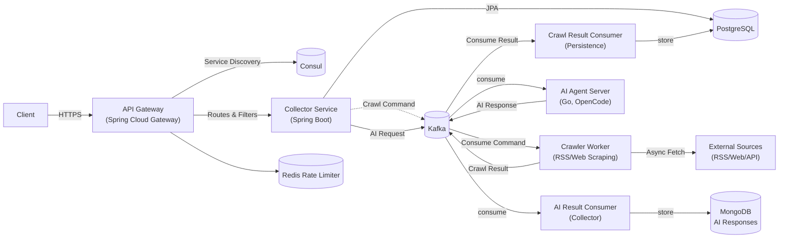
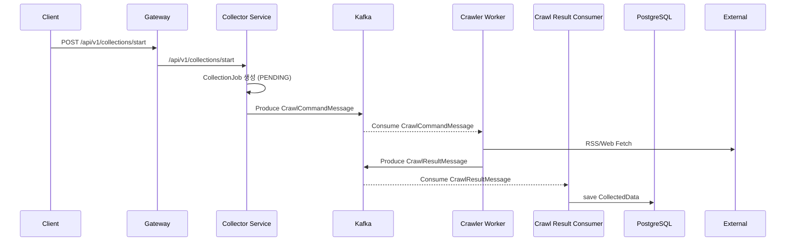
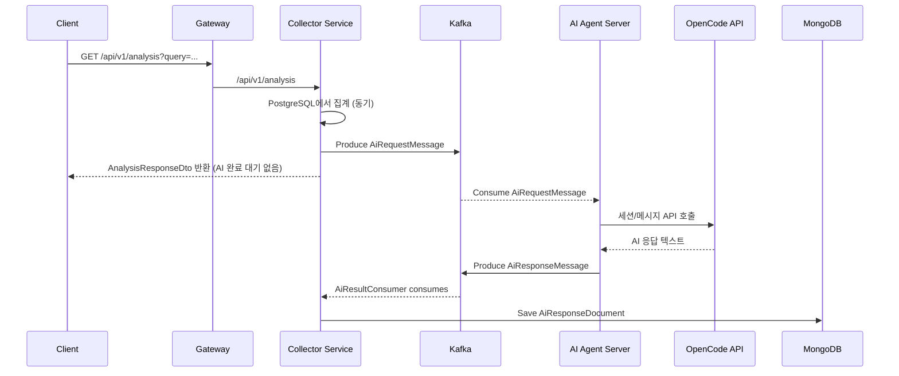

# 1. 시스템 아키텍처 개요

### 1.1 모듈 구성

| 모듈                        | 설명                            | 핵심 책임                                         | 주요 참조                                   |
| --------------------------- | ------------------------------- | ------------------------------------------------- | ------------------------------------------- |
| `api-gateway-service`     | Spring Cloud Gateway 기반 BFF   | 라우팅, JWT 인증, RBAC, Rate Limiting             | 참조[^api-gateway-files]                    |
| `data-collection-service` | Spring Boot 수집 마이크로서비스 | 소스 관리, 수집 작업 오케스트레이션, 데이터 저장  | 참조[^collector-files]                      |
| `AI_agent_server`         | Go 기반 AI 에이전트/워커        | Kafka 기반 AI 분석 요청 처리 및 OpenCode LLM 연동 | `backend/AI_agent_server/go-proxy-admin/` |
| `shared-libs`             | 공용 Java Library 모듈          | 공통 DTO·검증·Consul 연동 의존성 제공           | 참조[^shared-libs-files]                    |

### 1.2 인프라 및 의존성

- **Consul**: 모든 서비스에서 구성 및 서비스 디스커버리를 담당합니다 (참조: [^consul-config]).
- **PostgreSQL**: 수집된 뉴스 데이터와 소스 메타데이터를 저장합니다 (참조: [^postgres-config]).
- **Redis**: Gateway의 Redis Rate Limiter 백엔드로 사용됩니다(자격은 환경 변수/Consul 설정 필요) (참조: [^redis-config]).
- **Kafka**: Collector 서비스의 크롤링 파이프라인(`CrawlCommandMessage`, `CrawlResultMessage`)과 AI_agent_server와의 AI 분석 파이프라인(`AiRequestMessage`, `AiResponseMessage`)을 위한 이벤트 브로커 역할을 합니다.
- **MongoDB**: AI 분석 응답(`AiResponseDocument`)을 TTL 인덱스로 단기 저장하는 캐시/로그 스토어로 사용합니다.

### 1.3 요청-응답 흐름

1. 클라이언트는 Gateway의 `/api/v1/**` 엔드포인트로 요청을 보냅니다.
2. Gateway는 JWT 필터와 RBAC 필터로 인증·인가를 수행한 뒤 Consul을 통해 Collector 서비스 인스턴스를 조회합니다 (참조: [^jwt-rbac]).
3. Gateway는 라우트별 StripPrefix/Rewrite 필터를 적용해 내부 Collector REST 엔드포인트에 요청을 전달합니다 (참조: [^gateway-routes]).
4. Collector 서비스는 Controller → Service → Repository → Entity 계층을 통해 비즈니스 로직을 실행하고 결과를 반환합니다 (참조: [^collector-layers]).
5. 비동기 수집 작업은 Scheduler/Async Task를 통해 실행되며 외부 RSS/웹 소스에서 데이터를 가져옵니다 (참조: [^async-collection]).



### 1.4 기술 스택 요약

| 기술                          | 용도                                                                                                                                                                                                                                                           |
| ----------------------------- | -------------------------------------------------------------------------------------------------------------------------------------------------------------------------------------------------------------------------------------------------------------- |
| Spring Boot 3.2 / Java 21     | 서비스 런타임 및 언어 레벨 설정.@build.gradle.kts#20-82                                                                                                                                                                                                        |
| Spring Cloud Gateway & Consul | 서비스 디스커버리, 라우팅, 구성을 담당합니다.@backend/api-gateway-service/src/main/java/com/newsinsight/gateway/GatewayApplication.java#8-24 @backend/api-gateway-service/src/main/resources/application.yml#9-84                                              |
| Spring Data JPA & Hibernate   | PostgreSQL ORM/트랜잭션 처리.@backend/data-collection-service/src/main/java/com/newsinsight/collector/entity/DataSource.java#13-58                                                                                                                             |
| Lombok & Jackson              | DTO/엔티티 보일러플레이트 제거 및 JSON 직렬화.@backend/data-collection-service/src/main/java/com/newsinsight/collector/entity/CollectionJob.java#18-58 @backend/data-collection-service/src/main/java/com/newsinsight/collector/mapper/EntityMapper.java#5-148 |
| Rome (SyndFeed)               | RSS 피드 파싱 유틸리티.@backend/data-collection-service/src/main/java/com/newsinsight/collector/service/RssFeedService.java#3-147                                                                                                                              |

### 1.5 비동기 타임라인 예시

- **크롤링 파이프라인 (CrawlCommand → CrawlResult → CollectedData)**



- **AI 분석 파이프라인 (Analysis API → AiRequest/AiResponse → MongoDB)**



---

## 2. 서비스 상세 설명

### 2.1 API Gateway 서비스 (`api-gateway-service`)

- **역할**: 인증/인가, 라우팅, 속도 제한, CORS 등 API 경계 책임을 담당합니다.@backend/api-gateway-service/src/main/java/com/newsinsight/gateway/GatewayApplication.java#8-24
- **JWT 인증 필터**: `Authorization: Bearer` 토큰을 검증하고 사용자 정보를 다운스트림 서비스로 전달합니다.@backend/api-gateway-service/src/main/java/com/newsinsight/gateway/filter/JwtAuthenticationFilter.java#21-99
- **RBAC 필터**: HTTP 메서드에 따른 권한을 검사해 역할별 접근을 제어합니다.@backend/api-gateway-service/src/main/java/com/newsinsight/gateway/filter/RbacFilter.java#27-67
- **라우팅 전략**: `/api/v1/collector/**` 패턴과 기사/분석 별칭 요청을 Collector 서비스로 전달하며 StripPrefix/Rewrite 필터로 내부 경로를 조정합니다.@backend/api-gateway-service/src/main/resources/application.yml#27-84
- **Rate Limiter**: Redis 기반 RequestRateLimiter 필터를 적용합니다.@backend/api-gateway-service/src/main/resources/application.yml#36-63

### 2.2 Collector 서비스 (`data-collection-service`)

- **엔트리 포인트**: `@EnableAsync`, `@EnableScheduling`로 비동기·스케줄링 기능을 활성화합니다.@backend/data-collection-service/src/main/java/com/newsinsight/collector/CollectorApplication.java#18-26
- **Controller 층**:
  - `SourceController`: 데이터 소스 CRUD 및 활성화/비활성화 API.@backend/data-collection-service/src/main/java/com/newsinsight/collector/controller/SourceController.java#26-133
  - `CollectionController`: 수집 작업 생성·조회·취소, 통계 API.@backend/data-collection-service/src/main/java/com/newsinsight/collector/controller/CollectionController.java#34-120
  - `DataController`: 수집된 데이터 조회·처리 상태 변경 및 통계 API.@backend/data-collection-service/src/main/java/com/newsinsight/collector/controller/DataController.java#24-102
- **Service 층**:
  - `CollectionService`: Kafka 기반 크롤 명령 이벤트 발행, 작업 상태 관리, 통계 집계를 담당합니다.@backend/data-collection-service/src/main/java/com/newsinsight/collector/service/CollectionService.java#40-268
  - `CrawlCommandConsumerService` / `CrawlResultConsumerService`: Kafka에서 크롤 명령(`CrawlCommandMessage`)과 결과(`CrawlResultMessage`) 이벤트를 소비하여 `executeCollection` 실행 및 `CollectedData` 저장을 담당합니다.@backend/data-collection-service/src/main/java/com/newsinsight/collector/service/CrawlCommandConsumerService.java @backend/data-collection-service/src/main/java/com/newsinsight/collector/service/CrawlResultConsumerService.java
  - `RssFeedService`: RSS 엔트리를 파싱하고 중복을 제거한 `CollectedData` 엔티티로 변환합니다.@backend/data-collection-service/src/main/java/com/newsinsight/collector/service/RssFeedService.java#44-147
  - `CollectedDataService`: 콘텐츠 해시 계산, 중복 검사, 처리 상태 업데이트를 담당합니다.@backend/data-collection-service/src/main/java/com/newsinsight/collector/service/CollectedDataService.java#22-162
  - `DataSourceService`: 소스 메타데이터 CRUD 및 페이징 조회, 마지막 수집 시간 업데이트.@backend/data-collection-service/src/main/java/com/newsinsight/collector/service/DataSourceService.java#31-213
  - `AnalysisService`: 키워드(`query`)와 기간(`window`)에 따른 기사 집계/통계를 계산하고 분석 결과 DTO를 생성합니다.@backend/data-collection-service/src/main/java/com/newsinsight/collector/service/AnalysisService.java
  - `AiMessagingService` / `AiResultConsumerService`: Kafka를 통해 AI 분석 요청(`AiRequestMessage`)을 발행하고, 응답(`AiResponseMessage`)을 MongoDB `ai_responses` 컬렉션에 저장합니다.@backend/data-collection-service/src/main/java/com/newsinsight/collector/service/AiMessagingService.java @backend/data-collection-service/src/main/java/com/newsinsight/collector/service/AiResultConsumerService.java
- **Repository/Entity**: `CollectionJob`, `CollectedData`, `DataSource` 엔터티가 테이블 구조를 정의합니다.@backend/data-collection-service/src/main/java/com/newsinsight/collector/entity/CollectionJob.java#12-58 @backend/data-collection-service/src/main/java/com/newsinsight/collector/entity/CollectedData.java#12-81 @backend/data-collection-service/src/main/java/com/newsinsight/collector/entity/DataSource.java#13-58

### 2.3 Shared Libraries (`shared-libs`)

- 공통 Validation, Consul Config, Jackson 모듈을 `api` 구성으로 노출하여 모든 서비스에서 재사용할 수 있게 합니다.@backend/shared-libs/build.gradle.kts#12-24
- DTO/Mapper는 Collector 서비스 소스 트리에 존재하지만 추후 공유가 필요한 경우 이 모듈로 승격 가능합니다.

---

## 3. API 엔드포인트 명세

> **외부 호출 경로**는 Gateway 기준입니다. Gateway가 `/api/v1/**` 요청을 Collector 서비스로 라우팅하며, `/api/v1/articles`, `/api/v1/analysis` 와 같은 별칭 라우트를 제공합니다.@backend/api-gateway-service/src/main/resources/application.yml#27-100

### 3.1 데이터 소스 관리 (Collector)

| HTTP   | Endpoint                            | 기능                                                                                                                                                                                      | 인증 |
| ------ | ----------------------------------- | ----------------------------------------------------------------------------------------------------------------------------------------------------------------------------------------- | ---- |
| GET    | `/api/v1/sources`                 | 전체 소스 페이징 조회 (`page`, `size`, `sortBy`, `sortDirection`).@backend/data-collection-service/src/main/java/com/newsinsight/collector/controller/SourceController.java#28-41 | 필요 |
| GET    | `/api/v1/sources/active`          | 활성 소스 페이징 조회.@backend/data-collection-service/src/main/java/com/newsinsight/collector/controller/SourceController.java#47-57                                                     | 필요 |
| GET    | `/api/v1/sources/{id}`            | 소스 단건 조회.@backend/data-collection-service/src/main/java/com/newsinsight/collector/controller/SourceController.java#62-68                                                            | 필요 |
| POST   | `/api/v1/sources`                 | 소스 생성 (`DataSourceCreateRequest`).@backend/data-collection-service/src/main/java/com/newsinsight/collector/controller/SourceController.java#73-80                                   | 필요 |
| PUT    | `/api/v1/sources/{id}`            | 소스 수정 (`DataSourceUpdateRequest`).@backend/data-collection-service/src/main/java/com/newsinsight/collector/controller/SourceController.java#82-97                                   | 필요 |
| DELETE | `/api/v1/sources/{id}`            | 소스 삭제.@backend/data-collection-service/src/main/java/com/newsinsight/collector/controller/SourceController.java#99-106                                                                | 필요 |
| POST   | `/api/v1/sources/{id}/activate`   | 소스 활성화 토글.@backend/data-collection-service/src/main/java/com/newsinsight/collector/controller/SourceController.java#108-118                                                        | 필요 |
| POST   | `/api/v1/sources/{id}/deactivate` | 소스 비활성화 토글.@backend/data-collection-service/src/main/java/com/newsinsight/collector/controller/SourceController.java#122-132                                                      | 필요 |

### 3.2 수집 작업 관리 (Collector)

| HTTP   | Endpoint                                 | 기능                                                                                                                                                                 | 인증 |
| ------ | ---------------------------------------- | -------------------------------------------------------------------------------------------------------------------------------------------------------------------- | ---- |
| POST   | `/api/v1/collections/start`            | 지정/전체 소스 수집 시작 (`CollectionRequest`).@backend/data-collection-service/src/main/java/com/newsinsight/collector/controller/CollectionController.java#35-63 | 필요 |
| GET    | `/api/v1/collections/jobs`             | 작업 목록 페이징 조회 (`status` 선택).@backend/data-collection-service/src/main/java/com/newsinsight/collector/controller/CollectionController.java#68-80          | 필요 |
| GET    | `/api/v1/collections/jobs/{id}`        | 작업 단건 조회.@backend/data-collection-service/src/main/java/com/newsinsight/collector/controller/CollectionController.java#85-90                                   | 필요 |
| POST   | `/api/v1/collections/jobs/{id}/cancel` | 작업 취소.@backend/data-collection-service/src/main/java/com/newsinsight/collector/controller/CollectionController.java#94-100                                       | 필요 |
| GET    | `/api/v1/collections/stats`            | 수집 통계 조회.@backend/data-collection-service/src/main/java/com/newsinsight/collector/controller/CollectionController.java#103-109                                 | 필요 |
| DELETE | `/api/v1/collections/jobs/cleanup`     | 완료된 오래된 작업 삭제 (`daysOld`).@backend/data-collection-service/src/main/java/com/newsinsight/collector/controller/CollectionController.java#112-120          | 필요 |

### 3.3 수집 데이터 조회 (Collector)

| HTTP | Endpoint                        | 기능                                                                                                                                                                                    | 인증 |
| ---- | ------------------------------- | --------------------------------------------------------------------------------------------------------------------------------------------------------------------------------------- | ---- |
| GET  | `/api/v1/data`                | 수집 데이터 페이징 조회 (`page`, `size`, `sourceId`, `processed`).@backend/data-collection-service/src/main/java/com/newsinsight/collector/controller/DataController.java#26-50 | 필요 |
| GET  | `/api/v1/data/unprocessed`    | 미처리 데이터만 조회.@backend/data-collection-service/src/main/java/com/newsinsight/collector/controller/DataController.java#55-64                                                      | 필요 |
| GET  | `/api/v1/data/{id}`           | 데이터 단건 조회.@backend/data-collection-service/src/main/java/com/newsinsight/collector/controller/DataController.java#68-75                                                          | 필요 |
| POST | `/api/v1/data/{id}/processed` | 처리 완료 표시.@backend/data-collection-service/src/main/java/com/newsinsight/collector/controller/DataController.java#79-85                                                            | 필요 |
| GET  | `/api/v1/data/stats`          | 총/미처리/처리 건수 집계.@backend/data-collection-service/src/main/java/com/newsinsight/collector/controller/DataController.java#88-97                                                  | 필요 |

### 3.4 퍼블릭 별칭 및 기타 라우트

- `/api/v1/articles` 및 `/api/v1/articles/**` → Collector의 `/api/v1/articles` 및 하위 경로(분석용 기사 검색 API)로 전달.@backend/api-gateway-service/src/main/resources/application.yml#62-82 @backend/data-collection-service/src/main/java/com/newsinsight/collector/controller/AnalysisController.java#28-34
- `/api/v1/analysis` 및 `/api/v1/analysis/**` → Collector의 `/api/v1/analysis` 분석 요약 API로 전달.@backend/api-gateway-service/src/main/resources/application.yml#83-101 @backend/data-collection-service/src/main/java/com/newsinsight/collector/controller/AnalysisController.java#20-26
- `/actuator/**`, `/api/v1/auth/**` 등은 Gateway 필터에서 JWT 검증을 건너뜁니다.@backend/api-gateway-service/src/main/java/com/newsinsight/gateway/filter/JwtAuthenticationFilter.java#33-57

### 3.5 분석 및 기사 검색 (Collector)

| HTTP | Endpoint             | 기능                                                                                                      | 인증 |
| ---- | -------------------- | --------------------------------------------------------------------------------------------------------- | ---- |
| GET  | `/api/v1/analysis` | 키워드(`query`)와 기간(`window`) 기준으로 집계된 분석 결과(`AnalysisResponseDto`)를 반환합니다.     | 필요 |
| GET  | `/api/v1/articles` | 키워드(`query`)와 `limit` 기준으로 관련 기사를 검색하여 프론트엔드에 제공할 요약 데이터를 반환합니다. | 필요 |

---

## 4. 주요 데이터 포맷 및 스키마

아래 예시는 실제 DTO/엔터티 정의에 기반한 더미 데이터입니다.

### 4.1 데이터 소스 생성 (`POST /api/v1/collector/sources`)

- Request Body (`DataSourceCreateRequest`):@backend/data-collection-service/src/main/java/com/newsinsight/collector/dto/DataSourceCreateRequest.java#10-21

```json
{
  "name": "Yonhap RSS",
  "url": "https://www.yonhapnews.co.kr/rss/politics.xml",
  "sourceType": "RSS",
  "collectionFrequency": 1800,
  "metadata": {
    "language": "ko",
    "category": "politics"
  }
}
```

- Response Body (`DataSourceDTO`):@backend/data-collection-service/src/main/java/com/newsinsight/collector/dto/DataSourceDTO.java#8-23

```json
{
  "id": 42,
  "name": "Yonhap RSS",
  "url": "https://www.yonhapnews.co.kr/rss/politics.xml",
  "sourceType": "RSS",
  "isActive": true,
  "lastCollected": null,
  "collectionFrequency": 1800,
  "metadata": {
    "language": "ko",
    "category": "politics"
  },
  "createdAt": "2025-05-14T03:15:22.481Z",
  "updatedAt": "2025-05-14T03:15:22.481Z"
}
```

- Error 사례: `collectionFrequency < 60`일 경우 400 (Bean Validation). 중복 등록 방지는 DAO/DB 제약 필요 → **추가 확인 필요**.

### 4.2 수집 작업 시작 (`POST /api/v1/collector/collections/start`)

- Request Body (`CollectionRequest`):@backend/data-collection-service/src/main/java/com/newsinsight/collector/dto/CollectionRequest.java#5-13

```json
{
  "sourceIds": [1, 5, 9],
  "force": false
}
```

- Response Body (`CollectionResponse` + `CollectionJobDTO`):@backend/data-collection-service/src/main/java/com/newsinsight/collector/dto/CollectionResponse.java#6-14 @backend/data-collection-service/src/main/java/com/newsinsight/collector/dto/CollectionJobDTO.java#7-16

```json
{
  "message": "Collection started for 3 source(s)",
  "jobs": [
    {
      "id": 101,
      "sourceId": 1,
      "status": "PENDING",
      "startedAt": null,
      "completedAt": null,
      "itemsCollected": 0,
      "errorMessage": null,
      "createdAt": "2025-05-14T05:01:12.410Z"
    },
    {
      "id": 102,
      "sourceId": 5,
      "status": "PENDING",
      "startedAt": null,
      "completedAt": null,
      "itemsCollected": 0,
      "errorMessage": null,
      "createdAt": "2025-05-14T05:01:12.411Z"
    }
  ],
  "totalJobsStarted": 3,
  "timestamp": "2025-05-14T05:01:12.500Z"
}
```

- Error 사례:
  - 잘못된 `sourceId` → 400 (`IllegalArgumentException`).
  - 비활성 소스 → 409 (`IllegalStateException`).
  - 수집 중 예외 → 작업 상태가 `FAILED`로 저장되며 응답은 202 유지 (추후 조회 필요).@backend/data-collection-service/src/main/java/com/newsinsight/collector/service/CollectionService.java#37-155

### 4.3 수집 데이터 조회 (`GET /api/v1/collector/data`)

- Query Parameters: `page=0`, `size=20`, `sourceId`, `processed`.
- Response Body (`Page<CollectedDataDTO>` 직렬화):@backend/data-collection-service/src/main/java/com/newsinsight/collector/controller/DataController.java#26-50 @backend/data-collection-service/src/main/java/com/newsinsight/collector/dto/CollectedDataDTO.java#6-25

```json
{
  "content": [
    {
      "id": 8801,
      "sourceId": 42,
      "title": "정치권 주요 일정 요약",
      "content": "...",
      "url": "https://news.example.com/articles/8801",
      "publishedDate": "2025-05-14T03:00:00Z",
      "collectedAt": "2025-05-14T03:05:12.771Z",
      "contentHash": "6a1b...ff90",
      "metadata": {
        "adapter": "rss",
        "tags": ["politics"],
        "author": "news bot",
        "source_name": "Yonhap RSS"
      },
      "processed": false
    }
  ],
  "pageable": {
    "pageNumber": 0,
    "pageSize": 20,
    "sort": { "sorted": true, "unsorted": false, "empty": false }
  },
  "totalElements": 3512,
  "totalPages": 176,
  "last": false,
  "size": 20,
  "number": 0,
  "sort": { "sorted": true, "unsorted": false, "empty": false },
  "first": true,
  "numberOfElements": 20,
  "empty": false
}
```

- `processed=false` 필터가 지정되면 미처리 데이터만 반환합니다.@backend/data-collection-service/src/main/java/com/newsinsight/collector/controller/DataController.java#35-45

### 4.4 데이터 처리 완료 (`POST /api/v1/collector/data/{id}/processed`)

- Request Body 없음.
- 성공 시 204, 미존재 ID 시 404 (빈 바디).@backend/data-collection-service/src/main/java/com/newsinsight/collector/controller/DataController.java#79-85 @backend/data-collection-service/src/main/java/com/newsinsight/collector/service/CollectedDataService.java#102-116

### 4.5 분석 결과 조회 (`GET /api/v1/analysis`)

- Response Body (`AnalysisResponseDto`):@backend/data-collection-service/src/main/java/com/newsinsight/collector/dto/AnalysisResponseDto.java#7-14 @backend/data-collection-service/src/main/java/com/newsinsight/collector/dto/SentimentDataDto.java#3-3 @backend/data-collection-service/src/main/java/com/newsinsight/collector/dto/KeywordDataDto.java#3-3

```json
{
  "query": "삼성전자",
  "window": "7d",
  "article_count": 120,
  "sentiments": {
    "pos": 0.42,
    "neg": 0.31,
    "neu": 0.27
  },
  "top_keywords": [
    { "word": "반도체", "score": 0.89 },
    { "word": "실적", "score": 0.74 }
  ],
  "analyzed_at": "2025-11-20T10:15:30Z"
}
```

### 4.6 기사 검색 결과 (`GET /api/v1/articles`)

- Response Body (`ArticlesResponseDto`):@backend/data-collection-service/src/main/java/com/newsinsight/collector/dto/ArticlesResponseDto.java#5-9 @backend/data-collection-service/src/main/java/com/newsinsight/collector/dto/ArticleDto.java

```json
{
  "query": "삼성전자",
  "articles": [
    {
      "id": "8801",
      "title": "삼성전자, AI 투자 확대 발표",
      "source": "Yonhap News",
      "published_at": "2025-11-20T08:30:00Z",
      "url": "https://news.example.com/articles/8801",
      "snippet": "삼성전자가 차세대 AI 반도체에 대한 대규모 투자를 발표했다."
    },
    {
      "id": "8802",
      "title": "반도체 업황 회복 기대감",
      "source": "Maeil Business",
      "published_at": "2025-11-20T09:10:00Z",
      "url": "https://news.example.com/articles/8802",
      "snippet": "글로벌 반도체 수요 회복에 대한 기대가 커지고 있다."
    }
  ],
  "total": 120
}
```

### 4.7 AI 분석 요청 메시지 (Kafka `AiRequestMessage`)

- Topic (기본값): `newsinsight.ai.requests`
- Payload (`AiRequestMessage`):@backend/data-collection-service/src/main/java/com/newsinsight/collector/dto/AiRequestMessage.java#5-13

```json
{
  "requestId": "9f8b7c1e-1234-4b5a-bcde-0123456789ab",
  "type": "analysis",
  "query": "삼성전자",
  "window": "7d",
  "message": "다음 쿼리에 대한 뉴스 요약과 키워드, 감성 분석을 제공해 주세요.",
  "context": {
    "article_count": 120,
    "top_sources": ["Yonhap", "Maeil"],
    "lang": "ko"
  },
  "providerId": "opencode",
  "modelId": "gpt-4.1"
}
```

### 4.8 AI 분석 응답 메시지 (Kafka `AiResponseMessage`)

- Topic (기본값): `newsinsight.ai.responses`
- Payload (`AiResponseMessage`):@backend/data-collection-service/src/main/java/com/newsinsight/collector/dto/AiResponseMessage.java#5-12

```json
{
  "requestId": "9f8b7c1e-1234-4b5a-bcde-0123456789ab",
  "status": "COMPLETED",
  "completedAt": "2025-11-20T10:15:32Z",
  "providerId": "opencode",
  "modelId": "gpt-4.1",
  "text": "요약: 삼성전자는 AI 반도체 투자 확대를 발표했고, 시장은 반도체 업황 회복에 대한 기대를 보이고 있습니다...",
  "raw": {
    "choices": [
      {
        "message": {
          "role": "assistant",
          "content": "요약: ..."
        },
        "finish_reason": "stop"
      }
    ],
    "usage": {
      "prompt_tokens": 1234,
      "completion_tokens": 456,
      "total_tokens": 1690
    }
  }
}
```

### 4.9 AI 응답 MongoDB 도큐먼트 (`ai_responses` 컬렉션)

- Document 클래스: `AiResponseDocument`@backend/data-collection-service/src/main/java/com/newsinsight/collector/mongo/AiResponseDocument.java#10-24

```json
{
  "_id": "9f8b7c1e-1234-4b5a-bcde-0123456789ab",
  "status": "COMPLETED",
  "completedAt": "2025-11-20T10:15:32Z",
  "providerId": "opencode",
  "modelId": "gpt-4.1",
  "text": "요약: 삼성전자는 AI 반도체 투자 확대를 발표했고, 시장은 반도체 업황 회복에 대한 기대를 보이고 있습니다...",
  "raw": {
    "choices": [
      {
        "message": {
          "role": "assistant",
          "content": "요약: ..."
        },
        "finish_reason": "stop"
      }
    ],
    "usage": {
      "prompt_tokens": 1234,
      "completion_tokens": 456,
      "total_tokens": 1690
    }
  },
  "createdAt": "2025-11-20T10:15:32.500Z"
}
```

### 4.10 크롤링 명령 메시지 (Kafka `CrawlCommandMessage`)

- Topic (기본값): `newsinsight.crawl.commands`
- Payload (`CrawlCommandMessage`):@backend/data-collection-service/src/main/java/com/newsinsight/collector/dto/CrawlCommandMessage.java

```json
{
  "jobId": 1001,
  "sourceId": 42,
  "sourceType": "RSS",
  "url": "https://news.example.com/rss/samsung.xml",
  "sourceName": "Yonhap - Samsung"
}
```

### 4.11 크롤링 결과 메시지 (Kafka `CrawlResultMessage`)

- Topic (기본값): `newsinsight.crawl.results`
- Payload (`CrawlResultMessage`):@backend/data-collection-service/src/main/java/com/newsinsight/collector/dto/CrawlResultMessage.java

```json
{
  "jobId": 1001,
  "sourceId": 42,
  "title": "삼성전자, 3분기 실적 발표",
  "content": "삼성전자가 3분기 실적을 발표했다...",
  "url": "https://news.example.com/articles/12345",
  "publishedAt": "2025-11-20T09:30:00",
  "metadataJson": "{\"adapter\":\"rss\",\"source_name\":\"Yonhap RSS\"}"
}
```

---

## 5. 데이터 모델 요약

| 엔터티            | 주요 필드                                                                                  | 설명                                                                                                                                           |
| ----------------- | ------------------------------------------------------------------------------------------ | ---------------------------------------------------------------------------------------------------------------------------------------------- |
| `DataSource`    | `name`, `url`, `sourceType`, `collectionFrequency`, `metadataJson`, `isActive` | 수집 대상 소스 메타데이터 및 스케줄 설정.@backend/data-collection-service/src/main/java/com/newsinsight/collector/entity/DataSource.java#13-58 |
| `CollectionJob` | `status`, `startedAt`, `completedAt`, `itemsCollected`, `errorMessage`           | 수집 작업 실행 결과 및 상태 추적.@backend/data-collection-service/src/main/java/com/newsinsight/collector/entity/CollectionJob.java#12-58      |
| `CollectedData` | `title`, `content`, `url`, `contentHash`, `processed`, QA 메트릭                 | 수집된 기사 콘텐츠 및 품질 지표.@backend/data-collection-service/src/main/java/com/newsinsight/collector/entity/CollectedData.java#12-81       |

---

## 6. 추가 확인 필요 사항

### 6.1 Redis 구성 검증 템플릿

- **관련 파일**: @backend/api-gateway-service/src/main/resources/application.yml#100-106 · Consul KV (`config/api-gateway/...`)
- **목적**: Gateway Rate Limiter가 대상 Redis 인스턴스를 올바르게 참조하는지 확인

#### 체크리스트

| 항목           | 설명                                                                                   | 확인 결과 |
| -------------- | -------------------------------------------------------------------------------------- | --------- |
| 연결 정보 정의 | `REDIS_HOST`, `REDIS_PORT`, `REDIS_PASSWORD` 값이 환경/Consul에 정의되어 있는가? |           |
| 인증 정책      | TLS·AUTH 설정 여부와 보안 요구사항이 일치하는가?                                      |           |
| 장애 대비      | 장애 시 Failover 또는 대체 전략이 준비되어 있는가?                                     |           |
| 모니터링       | Redis 모니터링/알림 채널이 설정되어 있는가?                                            |           |

#### 점검 결과 템플릿

```markdown
## Redis 구성 점검 결과 (YYYY-MM-DD)
- 담당자: 
- 대상 환경: (dev/stg/prod ...)
- 확인 사항 요약:
  - 연결 정보: 
  - 인증/보안: 
  - 모니터링: 
- 후속 액션:
  - [ ] 항목 1
  - [ ] 항목 2
```

### 6.2 `force` 플래그 요구사항 정의 템플릿

- **관련 파일**: @backend/data-collection-service/src/main/java/com/newsinsight/collector/dto/CollectionRequest.java#5-13 · @backend/data-collection-service/src/main/java/com/newsinsight/collector/service/CollectionService.java#67-176
- **목적**: `force` 옵션의 기대 동작을 명확히 정의하고 서비스 로직 반영 여부를 결정

#### 요구사항 명세 양식

```markdown
## force 플래그 요구사항 정의 (YYYY-MM-DD)
- 작성자: 
- 적용 범위: (예: 비활성 소스 강제 실행, 오류 무시 등)
- 기대 동작:
  - 예: 비활성 소스도 즉시 수집하도록 허용
- 예외/제한 사항:
  - 예: 강제 실행은 일시적으로만 허용, 반복 시 차단
- 보안/권한 고려:
  - 예: 관리자 역할 이상만 플래그 사용 가능
- 서비스 로직 변경 필요 여부: (예/아니오, 상세 설명)
- 확인된 결정 사항:
  - 예: 2025-Q1 내 구현 계획 확정
```

### 6.3 데이터 소스 중복 방지 전략 수립 템플릿

- **관련 파일**: @backend/data-collection-service/src/main/java/com/newsinsight/collector/service/DataSourceService.java#77-141 · @backend/data-collection-service/src/main/java/com/newsinsight/collector/repository/DataSourceRepository.java#13-29 · 데이터베이스 스키마 (추가 확인)
- **목적**: 동일한 소스가 중복 등록되는 것을 방지하기 위한 정책/구현 정의

#### 전략 설계 체크리스트

| 항목           | 설명                                                              | 메모 |
| -------------- | ----------------------------------------------------------------- | ---- |
| 중복 기준 정의 | URL·이름·도메인 등 어떤 필드를 유일성 기준으로 삼을 것인지 결정 |      |
| DB 제약 조건   | DB 레벨 Unique 인덱스/제약 추가 필요 여부                         |      |
| 서비스 검증    | Service 계층에서 중복 검증 로직 구현 필요 여부                    |      |
| 예외 처리      | 중복 발생 시 사용자 메시지/HTTP 상태 코드 설계                    |      |
| 마이그레이션   | 기존 데이터에 대한 정합성 검사 및 보정 계획                       |      |

#### 결정 기록 템플릿

```markdown
## 데이터 소스 중복 방지 전략 (YYYY-MM-DD)
- 작성자: 
- 중복 기준: 
- DB 제약: (예/아니오, 세부 내용)
- 서비스 레벨 로직: (예/아니오, 세부 내용)
- 롤아웃 계획:
  - 단계 1: Unique 인덱스 추가 및 데이터 정합성 검사
  - 단계 2: API 검증 로직 배포
- 추가 고려 사항:
  - 예: 기존 중복 데이터 처리 방안
```

### 6.4 RBAC 역할 확장 계획 템플릿

- **관련 파일**: @backend/api-gateway-service/src/main/java/com/newsinsight/gateway/filter/RbacFilter.java#27-42 · 보안 정책 문서(추가 확인)
- **목적**: 역할/권한 구성을 확장하거나 동적 정책 관리 방식으로 전환하는 계획 수립

#### 계획 수립 체크리스트

| 항목             | 설명                                                       | 상태 |
| ---------------- | ---------------------------------------------------------- | ---- |
| 현행 역할 정의   | 현재 역할·권한 매핑을 문서화 했는가?                      |      |
| 확장 요구 수집   | 신규 역할/권한 요구사항을 수집했는가?                      |      |
| 정책 저장소 결정 | 하드코딩 → 외부 정책 스토어(Consul, DB 등) 전환 여부 결정 |      |
| 배포 전략        | 변경 시점, 롤백 계획, 점진적 적용 전략 확보                |      |
| 감사/로그        | 접근 제어 변경 사항에 대한 감사 로그 계획                  |      |

#### 변경 설계 템플릿

```markdown
## RBAC 역할 확장 설계 (YYYY-MM-DD)
- 작성자: 
- 변경 요약:
  - 예: analyst 역할에 DELETE 권한 추가 요청 반영
- 신규 역할/권한 매핑:
  - 역할: 권한 리스트 (예: analyst -> READ, WRITE, DELETE)
- 정책 저장 위치: (예: Consul KV, DB 테이블 등)
- 적용 단계별 계획:
  1. 정책 스토어 스키마 확장
  2. Gateway 배포 및 단계별 검증
- 검증/테스트 계획:
  - 유닛 테스트: RBAC 필터 권한 테스트
  - 통합 테스트: 실제 토큰 기반 시나리오 점검
- 위험 요소 및 대응:
  - 예: 정책 미동기화 시 롤백 절차 즉시 실행
```

---

[^api-gateway-files]: @backend/api-gateway-service/src/main/java/com/newsinsight/gateway/GatewayApplication.java#8-24 · @backend/api-gateway-service/src/main/java/com/newsinsight/gateway/filter/JwtAuthenticationFilter.java#21-102 · @backend/api-gateway-service/src/main/java/com/newsinsight/gateway/filter/RbacFilter.java#17-72
    
[^collector-files]: @backend/data-collection-service/src/main/java/com/newsinsight/collector/CollectorApplication.java#9-27 · @backend/data-collection-service/src/main/java/com/newsinsight/collector/controller/SourceController.java#26-133 · @backend/data-collection-service/src/main/java/com/newsinsight/collector/service/CollectionService.java#23-264
    
[^shared-libs-files]: @backend/shared-libs/build.gradle.kts#1-24
    
[^consul-config]: @backend/data-collection-service/src/main/resources/application.yml#33-51 · @backend/api-gateway-service/src/main/resources/application.yml#9-26
    
[^postgres-config]: @backend/data-collection-service/src/main/resources/application.yml#7-31
    
[^redis-config]: @backend/api-gateway-service/src/main/resources/application.yml#27-63 · @backend/api-gateway-service/src/main/resources/application.yml#100-106
    
[^jwt-rbac]: @backend/api-gateway-service/src/main/java/com/newsinsight/gateway/filter/JwtAuthenticationFilter.java#49-101 · @backend/api-gateway-service/src/main/java/com/newsinsight/gateway/filter/RbacFilter.java#44-67
    
[^gateway-routes]: @backend/api-gateway-service/src/main/resources/application.yml#27-84
    
[^collector-layers]: @backend/data-collection-service/src/main/java/com/newsinsight/collector/controller/DataController.java#24-102 · @backend/data-collection-service/src/main/java/com/newsinsight/collector/service/DataSourceService.java#31-213
    
[^async-collection]: @backend/data-collection-service/src/main/java/com/newsinsight/collector/service/CollectionService.java#67-176 · @backend/data-collection-service/src/main/java/com/newsinsight/collector/service/RssFeedService.java#24-147
